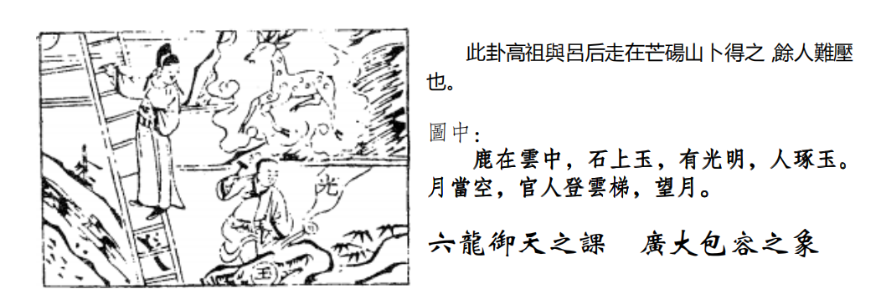
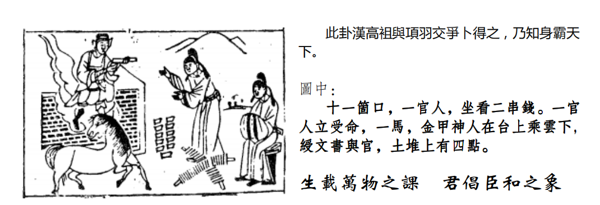

# 天纪04 象数易经 乾为天坤为地

## 乾为天

这个卦，易经的卦，他进入人间以后，在我们所看到的，就是为天的象一般外面讲易经，讲爻课，一般他们讲辞，并没有把他的神传出来。所以刚开始这第一个卦,我会讲的很仔细,以后的卦以此类推。这个第一个爻叫初爻,二爻,三爻，四爻，五爻，六爻。
我们老祖宗呢，他把一个事情的发展，进展分成六个阶段，当你进入每一个阶段的时候，层次都不一样。怎么解释?比如说，你正好是位居第四爻，在我们初爻的时候，叫做下，中爻也就是二爻的位置叫着将，三爻的位置叫做相，四爻的位置我们叫做宰，五爻的位置叫做君，六爻的位置叫做过。

这是他的层次，所以易经我们讲初爻的时候，初交是下爻，是潜龙勿用，下指的是下民，你还没有入朝当官，你在野，闲云野鹤，不是在官场，这是潜龙勿用。刚开始的时候，最开始的时机。那在潜龙勿用的时候，诸位要自修，这是自修最好的时机。

当你有一天进入二爻的时候，为将的时候，当一个主管的时候，或者当一个县长的时候，我们叫见龙在田，易经上的爻辞是利见大人，这个文字上尽量少叙述，我尽量要这样子去想。这个意思是说，如果你今天当了主管，你还是阳，初爻也是阳，你当主管，跟你当百姓的心是一样的，懂不懂，刚开始你是阳，阳主刚，那到了二爻的时候，你还是阳，还是主刚，你不要当了官以后就忘记了你是潜龙的时候，现在很多人当官就忘了百姓懂不懂，不可以哦，要阳刚，内心不能因为你做了主管而改变，所以这个时候利见大人，这个时候适合你去交很多对你有益的朋友，诸位怎么样选择对你有益的朋友:第一个交比你懂得多的人，不要老是交那些比你不懂的人。第二个，术业有专攻，交跟你同样类型的人，比如说你是律师，我是医师，我们在一起，律师医师的问题就解决了，对不对，哦，你是会计师，那我们三个可以开一个国家了。千万不要交那种一天到晚到你面前借钱的，
进入第三爻的时候，我们易经分两段，到第三了，这是下卦，这是上卦，这是内，这是外,对下卦来说,第三爻是不是到顶了，所以你从下往上升,到顶啦,易经说什么，终日乾乾。为什么要这样?当你再升一级，到相的时候，你每天要警惕自己，再要进德修业。所以呢，有人到42岁以后，还去修博士，因为到了这个阶段，如果再不去进德修业，上不去了。
但是从初爻到三爻，内在都是阳刚的，内在都不变，不要忘记了你做百姓时候，百姓的苦恼，不要忘了。这个时候要进德修业。

当你终日乾乾、进德修业的时候，不要往上看，要往下看，这个时候，你会跳到外卦,跳到第四爻,做宰相的时候,做君王的左右手,这个时候要或跃在渊为什么要,龙指的是一个刚正的人,你到这个时候呢,要待时机而动,待机而动到底是跑回深渊呢,还是继续呆在这边,要看你的主子,你的君王,要顺时而动，不能乱动。看清楚时局。
举例，如果我们当到这个位置，结果有一天开始政争，为了位置开始争权，这个时候，如果我们是相，我们进入宰的时候，利见大人，我已经修到博士了对不对，进德修业，那这个阶段，会近天子了，如果有政争的现象产生，最好的是什么，跑路，有机会到国外去当大使，我就去了，不要参与进去，这叫做因时而动，因为在争的时候，你走哪边都不对哦，将来都会有仇人，那出去的话，等到政争停下来了，君爻见的时候，你自然而然会受重用，所以我们受重用的都是国外回来的。速度快一点。

这样你在宰这个位置上,就很稳,或跃,就是看时机而动,否则你一念之差,终身没有了，就没有机会再回头了，当你进入君王的时候，当你有一天做了天子以后，我们叫飞龙在天，那你注意看，从下面到上面，阳阳阳阳一路，即使你从最下在野的时候，一直千到是天子的时候，你的心都没有动哦，都是刚正，守着你的原则在做事情，所以乾卦叫贞正，一定要坚心，不要忘了你是百姓的身份，你有一天还会做百姓，这是到了第五爻。

如果,易经上面来说,你当了君王,结果呢，你没有往下看,你还在往上看还不够,皇帝怎么够呢,我要当天子,当圣人,天子不够了啊,我要当圣人了哦我要当神，当你进入第六爻的时候。你还是往上看的时候，叫做亢龙有悔，过激的龙，天下你只相信自己不相信任何人，请问你，全国两千万人，都是没有能力的吗，不一定，造成无民无辅，进入亢龙有悔时，你会永远没有百姓跟到你，没有人敢辅佐你，比如谁，袁世凯!当总统怎么够,我要当皇帝,当了皇帝还不够,我要当天子,当神!亢龙，诸位，当到君王了,一定要往下看,绝对不要往上看，六个爻，这是天机。
如果有一个人来找你，倪先生，我现在遇到问题，我现在是在相这个阶段，你看我是继续出国读博士进修好,还是继续留在这里当官好,今年已经四十岁了,如果我出国读书，会把老婆孩子留在这边，分居很痛苦，我不去拿那个博士帽的话，可能我的官运就到此为止。他就在这时候终日乾乾，不知道怎么办，你告诉他，进德修业，去读书!才会再进一步。不去读书，到此为止了。

如果是宰这个阶段的人，来找你呢，你告诉他，要见机而动，见时而动，这个时，就是我刚才讲的，外地会比本地好。
如果是初爻这个时机来找你的，你告诉他，好好地进修，然后参加考试，准备进入第二个阶段。
那来找你的人，不一定是哪一个阶段，还有你自己知道自己面临哪个阶段，要知道是什么时候，要怎么做。
下面介绍六十四卦，每个卦都有爻变，比如说我们乾为天，你如果按照这个原理来做事情，你就是乾为天，了解我的意思吧，懂不我的意思。

比如说我们有一个卦，天地否，你如果按照天地否的每个爻的方式来做，你就否了，可能还要加个病，痞子了。
所以我们研究易经八卦,可以让自己变成那个卦,也可以那个人变成那个卦然后看到这个人在什么状态之下，我们就知道他目前处在哪一个卦的第几爻，然后从这个爻要往上走，如何从这个爻，从这个卦，让他变成地天泰，或者火天大有，或者是进入乾为天，一下，你的念就改过来了。这就是易经。所以我们讲易经的时候，从乾为天第一个讲，第一个这是天的性，天的定位，再来讲坤为地，天地定位,然后开始循环了,就好像手表一样,一分两分,那如果你走到 25 分如何变成，我们马上就看到了，你会变成什么，然后就是26，27,28，我们就看到了，这就是我们要学的东西。就是站在外面看到里面藏什么。
那这个乾为天呢，诸位看这个图像:

这个图有个官人在登梯，有没有，空中有个路，有个人在那里磨玉。玉上面有光，月在空中，这是什么意思啊，下面这个解曰，你不要看，只是把那个图，解释一下。
如果今天有个人来占卜，来找你，倪先生，我今天来找你，我父亲病重，能不能卜卦看看有什么问题,一ト,卜到乾为天。楼梯旁边,上面有个官人在上面:
梯上的官人，就是棺，你不要被图绑住了。懂我的意思把。

那如果以人间道来说,倪先生,我的官运不亨通,以后会不会亨通?一ト卦，乾为天，你就跟他说，官人站在梯上，就是居上位而不骄傲，你没升官就是因为你居上位而太骄了。你看他看那个摩玉的人，往下看，你看为天那个在梯往上看，爬楼梯，老祖宗就告诉你往下看嘛，有个人在磨玉。玉啊，空中有一个禄，代表是空想，意思是说，你要断念，我们是来做官，不是为了钱的，要放在空中。

这个工匠，我们图上只要看到工匠，后面很多图中有工匠，今天你为什么请工匠到你家来，就是要改门面，就是改朝换代。
那玉在石头中间，玉还没有露脸，代表事业尚无成功，同志还需努力。事业未成。所以卜一个人的官运，他会升官，但是要往下看，绝对不要往上看，绝对不要骄，一定会升官
如果卜到疾厄，是凶。
那如果卜生男育女呢，六个爻都是阳，当然是阳了，不用讲了。那老师，六胞胎?不会哦。不要在那里空想!
这里很多都是有根据的，以后我们讲测字的时候陆续都会讲。个人在琢玉啊，动作很重要，尤其对乾为天当官的人，人琢玉啊，人那那边雕玉，告诉我们要小心谨慎也。雕玉的时候，很小心，不然的话手一抖玉就破掉了，破了黏回来价钱就没有了。

这是乾为天这个卦，遇到卜筮的时候，我们要给客人这样解释，你看，我们讲占的时候，他都很分散，一个象有很多种解释，决定在看你卜什么事情，客人来问你的时候，你一卜，各方面的事情都可以卜到。
那举例,如果你卜婚姻呢,一トト到这个乾为天,你说我这个婚姻可不可成婚姻可成，但是要坚心!要像磨玉那样很小心，不然的话就破掉了。你如果不小心，玉就会破的，玉还没有出石，所以你一定要有坚心，小心谨慎。诸位还有什么看不懂的?有没有?
月在当空,后面有很多月在当空,清明之象,代表说政治是清明的,你不明本人不明哦，你自己错了。如果不是****，代表你是闲云野鹤，可以退隐山林,这个代表政治是清明的，错在你本身自己，你本身一定是骄，过于骄，一定要不骄，就会成事。

所以一个乾为天卦卜出来，我们有爻课进展的时机，可以做什么事情，如果他的阶段刚好是相，比如说，做到部长了，相!到了院长是宰了嘛，好，如果这个时候来，你要他进德修业，你要继续努力哦，对你比较好。

## 坤为地

这个卦，我们介绍易经，一定是天地定位，天的性，前一堂课就有解释。我们来看地的位置，坤为地，和乾为天，这两个，刚才忘了介绍，如果在阳宅学上来说，这边是东南西北，西北方是父，西南方是母，母居母位，为坤，为地卦。父居于父位，为乾为天。一个房子，不管门在哪里，我们先看布局，就房子的中心点来说，你的名字是妈妈，住在太太的位置，就是坤为地。你是爸爸，住爸爸的位置，叫做乾为天，如果太太住先生的位置，叫做地天泰，懂不我的意思每讲一个卦，我就要讲阳宅上在哪个位置上。
所以如果你结婚以后，一直住在父亲的位置，自然而然，会把你养成乾为天的性，一直在往下看，你也不知道为什么，就觉得这样比较对，当你住的对的时候，你的念头就是对的。你出来就是乾为天。
你如果住错了，住到妈妈的位置，就是天地否了，坤为地呢，就是太太住太太的位置，这个有没有疑问。

所以你到房子里，罗盘一看，西南角是坤，一看是妈妈住的，一看坤为地，坤为地代表什么意义，就在这里。
这个坤为地的爻呢，123456，从第一爻到第六爻，全部是阴交，下面是内卦，上面是外卦。
这是下卦、这是上卦，名词很多，其实都一样。
初爻的时候，这个坤为地和乾为天，德同法异。它是六个都是阴，从头到尾他的心就没变过，阴，主柔，主静。

乾为天，全是阳，从头到尾都是阳，没有变。所以德是同的，方法不同，乾是刚健，坤呢，是以柔静。一样可以做到很高。
自然界上来说。柔静就是地性!地能承载万物，他的柔性，随便什么东西他都接受了，把他消化掉，再返回给天，他从来不邀功，从有天地以来，他就一直做这个默默无闻的工作，都没有变过，自始至终，这个德同，方法不一样。

那我们易经上面，我再介绍一个稍微深入一点的，我不敢太深入了，怕大家觉得太复杂，135 爻的位置是阳位，246是阴位，这是有目的，我要跟各位讲是有目的的，第一爻的时候，应该是阳爻，结果第一爻是阴爻，所以第一爻呢易经上面写了，刚开始，我们所谓的阴，就是柔，就是寒，第一应该是阳，结果第一爻是阴，本来是阳爻的位置，被阴爻占领了，阴来进来，这就好像自然界的现象,当你脚踩下去,踩到草里面，踩到霜,有声音,一踩下去,心里要想到,马上有大风徐要来了，更冷了，叫履霜坚冰至。这个什么意思呢，比如到了人间道，意思是这样子的，当你发现到小人的时候，要赶快去掉，这叫做戒之初，你如果不去掉，坚冰就来了，如果你等到坚冰来了在去掉，你就不是圣人了，我们要模仿圣人嘛，对不对，所以一发现不对，马上开始，当你训练小孩子的时候，当你发现他错的时候，你马上要修正他，如果你狠狠地修正的时候，你太太跑出来，哎呀小孩子嘛好言相劝就好了，宁向直中求，不向曲中取，你好言相劝他以后什么作奸犯科吸毒什么都来了，一开始，你的小孩子有点贪，或者有一点动歪脑筋的时候,马上就要修正他,履霜坚冰至,强烈的修正,他根本就不敢想别的。千万不要委婉地相劝，没有用的!这个时候要把中国妇女的美德丢掉，否则你以后很惨,你看到你孩子失败,当你发现到当年错的时候就太晚了,要履霜坚冰至,一开始就戒，戒之初啊。这是初爻是阴爻的意思。

所以呢，如果你刚开始第一步，到一个地方去上班，到一个公司，一开始进入,如果遇到阴,是反的,位置应该是阳,结果你遇到阴,结果你一去新公司发现不是你当初想象的,懂不懂,你要履霜了,后面坚冰马上至了,马上要警戒懂我的意思吗，履霜了，哦，你还想着你有中国人的美德，改变周围的人，教大家读读经书，这是很好的想法，你还没有教完经书，坚冰就来了，把你干掉。这是坤地。
那如果进入第二要,刚好是阴爻,居阴位,如果你跑到第二爻这里的时候呢,直方大，不习，无不利。
你如果第一爻过去了，进入第二爻的时候，就是将的位置的时候，将就是科长啊，处长啊，你有三个字，易经收直方乃大，什么叫做直，如果我们今天交一个朋友，你有什么不对，他敢直接告诉你，好朋友!这是直的意思。同时你对人家也是直，不要背后去讲人家的闲言闲语，当面去讲。
什么叫做方，就是讲道义。义呢，诸位前面学过，断后，后出义也，如果我在你面前讲他的闲话，我刚讲，你就说他不是这样子的人，你不用跟我讲，你为什么在我面前讲他的闲话，你的目的在哪里，这就是他帮他断后，直方，乃大柔静，但是要直方大，只要你掌握这种个性的时候，诸位呢，不习，即使你什么东西都不懂，你的资历可能比别人差，社会上很多人，他学历不够，可是他非常会做事，这个，我们有一位李国鼎，一辈子不用考试上来的人来银行做事，为什么，他会考试，但是不会做事啊。所以我们现在的科甲有问题。

所以即使你不懂，不习，但是没有什么不利的。所以诸位千万要记得。所以圣经也讲的很好啊，不要去批评人家，哪一天上帝会批评你哦。直方大，讲真话是大家都在的时候讲真话，你不在的时候，我在别人面前讲你的坏话，那都是假话，诸位一定要听进去，这就是直方大，别人讲他的坏话，你一定要帮他断后要把是否纠正，叫做帮，现在大多数人都是一起讲人家坏话，人云亦云就去了，脑筋都搞不清楚。那到第三爻是阳位,那他还是阴的性,柔的性,这是至始至终，到了第三爻，做到相的位置，还是柔，这是易经讲的含章可贵。上次我就给你讲过含章之美，做属下的，今天已经领了老板的薪水了，你做什么事情，你去帮老板签约，订货，验货，这是天经地义的，大家摸着良心讲，如果你是老板，你愿不愿意花钱三万块请你在那不要动，你动我再给你另外两万，哪有这种事啊，你是我儿子我也没这样对你好，你要做事，人家给你薪水，你不要在乎人家给你多少钱，你要在乎自己做了多少事情，现在很多人哦，你请我上班要给我多少钱他从来不知道自己做了多少事情，就是没有含章之美，含章之美的人呢，你是氶相，你给君王做事，你做任何事情，统统不表彰，闷闷地在那边做，这叫含章之美。这种人有地的厚性，这种人可以用，居于阳位，还是柔性。
到了第四爻,易经叫做刮囊,就是闭口,为什么要闭口,因为第五爻是阳位，阴居在那里，第四爻是跟第五爻最接近的，他的意思是说，当你到这个位置的时候，他是君，你是臣，两个人很接近的时候，当你的君主、老板、总统、天子、董事长，跟你最接近的，而你发现到你们两意见不合，要刮，闭口，董事长老板天子说什么，你就去做就对了，要闭口，不要去讲。

你讲了有两个后果，第一个，你一讲，他会认为你贪什么东西。第二个，你讲了，如果他没有听你的话，按他的意思做，错了，发现你讲的是对的，他会把你干掉，为什么，因为有你，他太可怕了，功高震主。闭口。所以当你哪天跟你的主管发生冲突，闭口是最厉害的，就按照他说的做就对了，错了也是他负责对了也是他负责，他让我这样做的啊，但是你不要把责任推出去，什么都闭口，即使你按照他的话去做了，被他骂了，你也不要说不是我要这样的是他要我这样子坐的，你被他骂了，你也闭口。随时要记得闭口。做也闭口，被骂也闭口，先生，你这样做就会逃过这一劫。否则你走路，退隐山林，后面有很多卦叫你退隐山林。
那第五爻是君位,对不对,结果阴居君位,代表女人来当皇帝,所以说黄裳,元吉。为什么，裳是下等的衣服，下衣啊，下面的衣服，衣在上面，你如果今天是武则天，有一天刚好当了天子了，阴居阴位啊，你要柔静，你要尊重所有的大臣，大成穿的衣服都非常的漂亮，朝服，你呢，你不要穿个龙袍，阳不行哦，因为你是阴居阳位，你是逆位的懂不懂，这个时候要穿素服，坐在那里，抱着请教心理,态度非常恭谦,请教你的看法,哎你的看法非常好,就按照你的方法去做。你千万不要去亢，阳位的时候，不行。

如果你要去亢的时候，进入第六爻，龙战于野，其血玄黄。你硬要去亢，好了，玄是天的杂色，黄是地的污色，天地都杂色了，天地都感染了，其血玄黄所以一定会遭到很不好的结果。所以历史上有几个女的皇帝，到头来就是没有掌握到这个原则，如果掌握到这个原则，不会有这个事情，所以武则天时代的天官是不是很好，他太过了，进入第六爻。

好，大家神回过来，如果有一个人找你问事情，你还没有卜卦，我现在是公司的董事长，那我是女孩子，我继承我父亲下来的，对不对，阴柔居阳位，里面很多的高级主管，都是在公司呆了很久，很多年，这个时候，如果你一亢，龙战于野，会冲突很大，因为你的女的，女孩子柔居阳位，这个时候呢，你要越穿的朴素，让手下穿得越好，坐在这边，中规中矩的听，听完以后，说哎你的意见很好，这样子，我回去研究一下，你的意见也很好，我也回去研究一下，如果你会看相,看他是真正的贤臣,采纳他的意见去做,对哪些人有怀疑也好好考虑一下回去问问你的父亲问问你的家人，易经上说问有贤能之人，然后再做定夺。然后随时要保持这种戒心，千万不能亢，一亢进入第六爻，其血玄黄，这个人一定不但背叛你，还打击你，还乱搞，结果一定是这样，所以，即使我们不用卜卦，她进来，我们就知道她在哪个阶段，那如果同一个公司，来找你的是她的经理，刚好在第三爻的位置上，对不对，你要含章之美。经理来说，倪先生，请问你，我现在是经理，我上面还有副总，副总上面还有执行副总，上面还有总经理，现在董事长换人了,换来一个女的,我怎么办?ok,先生,您现在在这里,含章之美,你现在开始，不要去争功，就闷闷头去做事情，好好地去工作，公司有没有换老板，有没有加薪水，不要管，你就努力去做，很快就可以跳到第四交这里。会不会以此类推，所以来的人，来的时机，不一定是同一个阶段，所以我们要看他在哪个阶段，给他一个最好的建议，了解我的意思把。就是坤为地的柔性。

有个人，从空中下来，一个猴蹲在那边，一个墙，一个马在下面，一个十一个嘴巴，口在中间，两串钱在地上，一个人坐到，一个人站着，官人啊，什么意思啊。
诸位呢，进入占卜，如果你占卜，卜到这个卦，坤为地，有几种解释，我统统解释给你听。
首先，一个人坐在椅子上，一个人站在这里，这是官人，对不对，地上是不是两串钱，是不是这样，两串钱嘛，人家画的不好，又不是毕加索，串嘛，是不是这样写，两串钱，代表忧心忡忡。

两串钱是忧心忡忡，然后钱放在地上，官人看到钱为什么忧心忡忡，想拿又不敢拿，贪污。
那十一口，是不是吉啊，这是一种解释，不是说贪污是吉，这是两件事哦。十一口，这个十，一，加上口，代表陳;然后呢,一个人从空中下来,人代表民心,代表有人检举,检举也是民心啊，有一匹马，马有两个解释，一个是肖马，属马的人。另外一个呢，这个马回头，看到没有，第一个属马的人逢此卦调动，一定会调动，变动。
后面呢，你看一个人坐到，一个人站到，中间有个小山头，有四个点啊，你看我怎么写，四点在土上，黑呀!读图给你看啊。你说画的很分开啊。
我跟诸位讲，有人卜卦，我讲个例子你听，联合起来你听，有一次我一个朋友来卜卦，一卜坤为地，他是司法界的人士，他本身是属马的，然后他现在办的是公家单位贪污的案子，两个人，联合起来贪污，已经被关的人，姓陈，然后是有人检举上来，财查他们贪污的被关的，你看像不像?是不是吓一跳啊。

那十一个口代表吉，如果做这个事情，同样代表成，十一口代表会吉。但是有马在里面，这个案子有变动驿动的现象，可能他没有办完，就会离开啊，转交给别人。会有这种象出现。懂不懂我的意思。为什么，因为上面还有四个黑点黑黑的，还没有拨云见日哦，他们还有黑心，钱掉在地上，他们想拿，结果他们已经先拿了一笔钱，还有一千多万放在银行里面，不敢拿，他们在等他拿，不敢拿，是公款，明明六十万，他可能打成六千万，懂不懂，想去坑啊，钱进来，拿走一部分，还有一大部分不敢拿。不是忧心忡忡吗，看到钱又不敢拿。那检举上来，停在那边，是不是这个象。
诸位以后，你们不要看我们讲占卜的时候，很分散，你卜筮的时候，就看到
这个十一口，除了代表吉以外，也代表众口铄金，也有替代众人发言的象替老百姓发言的象。如果今天有个人来找你,哎我准备参加选举,你看看怎么样，一卜，上，为什么，他替百姓发言的象。
这个金甲神人，各位在易经上会看到很多金甲神人，都是指得民心的人，比如说选出来的民意代表，或许你不喜欢他，但是他还是票那么多，他得民心啊。

这个堠呢，过去所有的土墩，堆起来的土墩，中国有个名词叫做，所以你看一个个砖头砌起来，所以你看中国四合院门口右边，插旗有没有，旗子是不是插在一个堠墩上面，这个土墩，就是堠，呢，有绶官封侯的象。
那如果有一个人来找你，看看今年会不会升将军，一ト到坤为地，你问他先生您贵姓，我教陈森林啊，去，上!对不对，你了解我的意思把，成格!如果他不姓陈，先生您属什么的，我属马，成!看到没有，成格，我属猪，对不起，回头!没有什么用。同样的人来，要消要合的，后面很多诸如百家姓都有。我不属马也不姓陈，我姓马，也合格!一样，你不要那么挑剔嘛。要会变通。
有没有什么问题?所以卜筮的时候，我们要看他卜什么事情，如果有一位先生来问你，我太太要生小孩了，看看他是男的女的，一ト坤为地，从头到尾都是阴，先生你是第几胎的，我是第六胎的，那你还是女的。那如果你是第二胎，先生你还有四胎没生完，都是女的。那你说倪先生怎么办，有啊，我们阳宅啊!后面讲震为雷的时候，会跟各位讲到，生男生女。
这就是我们卜卦能断事，也能帮助人家，否则你光是卜卦，你不去解，讲完了他还是没有办法,你怎么办呢,他来找你问,事情是很准,问题是于我无补啊。对不对，我们有很多化解的方法，每一个卦都有对应的解的卦。
我们今天介绍到这里。
