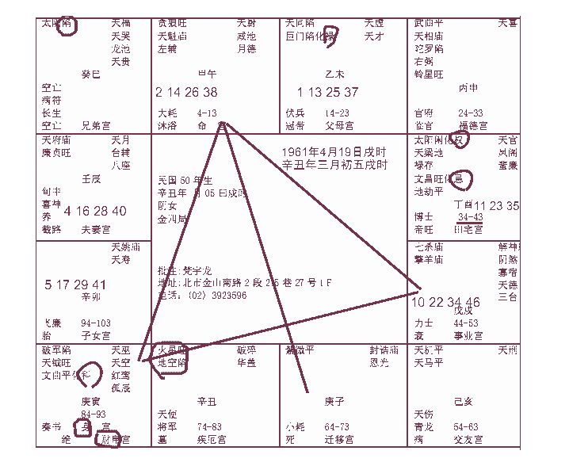

# 天纪05 紫微斗数 紫微星在子

诸位已经拿到案例讲义了，有十二张。我仔细跟各位介绍，这十二张为什么给十二张，我们所有的星，统统是按照北斗星君，诸位在排八字的时候就知道是以北斗星君为主，其他星都是按照北斗星君在转，所以我们以紫薇星为主，所以，所以从第一张到第十二张，紫微星在子宫、丑宫，在寅卯辰已刚好绕一圈回来，所以十二张，刚好紫薇星在十二个位置。如果以紫薇星来看的话，我们不看其他，就光以紫微星来看的话，八字就是这十二个。了解我的意思吧，那其他的变化，只是宫的变化，还有宫，命宫会转啊，还有科权忌，会转动、变化，但是基本上就是这样子。十二种形式，星都会聚在一起，因为这个紫微星，统统聚在一起，排起来都是一样的，这样子我们从这个角度来教比较简单，如果光教一些什么哪些星在一起叫做什么，什么什么格，这样教的话，你反而不好记。我们光以紫薇星来看。
诸位，我们介绍的时候，一张张的批，会批得非常详细，利用批的同时呢来教诸位如何看以外，还有如何批八字。统统结合例子讲。
首先诸位看第一张，辛丑年三月五号，戌时生人。

我们批这个八字，为什么用这个八字，因为这个八字紫微星刚好在子宫，诸位先不要看什么命宫官禄宫财帛宫，你光看星，紫微星，转一圈。可能紫微星在子宫，命宫不一定在午宫，命宫可能会有十二个地方，了解我的意思把。那我们首先拿到一个八字，有一个大原则，诸位要知道。

## 命宫

诸位来看，这个人，命宫在午宫，贪狼入命，紫星在对面，如果，我们以时间来说，各位注意看哦，所以我们在批的时候来讲，贪狼星呢，他是一个桃花星，但是，贪狼星有个大原则，他以在亥子宫，亥宫是晚上 9-11 点，子宫是 11到凌晨一点，这两个宫，我们又叫做水宫，如果贪狼星在亥宫或者在子宫才是正格桃花星。如果贪狼星在午宫，你不要随便乱批桃花星哦，他不是桃花星，他是武官星，那贪狼、破军、七杀，这些武官星呢，最希望，最好是，碰到火和铃，所以你们看书，会有一句话，叫做:火贪格，火贵格。就是主出武贵，武官。

诸位，所有的午时坐命的武官，晚上的贪狼星，要长得高大，魁梧，女孩子男孩子都一样，肥厚，午时的贪狼，武曲、七杀、破军，反而要长得很小，越小越瘦越好。举例,你看我们王生就是这样的命,你看他跑出来,干干的,红红的头发往上面翘，这是标准的火型的人，火形的人，所以王生是将军。那火格就是瘦卡卡的，你看那个林文礼，也是矮小的，空军最矮的就是他了，他是总司令，那是大贵!反而是大贵，所以你们批八字，不要乱批哦。

## 五行人

今天以前，你们看到的好的，其实是反的，懂不懂我的意思我们在相上面，把人分成五种形，一种是是木形，瘦瘦高高的，像王永庆就是木形的，那木形的人呢，我们要形出现，一定要纯，很纯才行，比如说你脸很瘦，手很瘦，肚子很大，那不是木形，要纯木，要从头到脚都瘦，连那个脚伸出来都是干干的，手伸出来也没有木，纯木。
纯火呢，也是干干的，但是红红的很热，好像火焰山那样的头。
土形的呢，就是厚重，像我们过去的总统，经国先生，就是土形人，很厚重，土是地厚嘛。

所以头就是要圆圆的，脚一定要方方的，地是方的，天是圆的，手伸出来也是厚厚的,摸到没有骨头,然后全身圆圆的厚厚的,重重的,这才是纯土形的人。你如果遇到一个土形局，脸圆圆的，其他都像啊，结果手伸出来，干干的，就不是纯土形局的人。因为他有一个部分不合。
纯金形局的人呢，比如说，什么叫金，金是白色的，所以要方方的，金属都是方形的，像钻石切割出来都是方方的，白白的，手伸出来，都要是方的，我们的林洋港林院长，就是金形的。
水形局的人呢，要圆圆的，到哪里看，从哪个角度看，都是圆的，谁呢，我们的考试院长，邱*焕，脸是圆的，额头也是圆的，手伸出来也是圆的，厚厚的肥肥的，圆形的，这是水形局的人。
那我们在相上要成局的人，一定要纯，越纯的越贵，非富即贵。这是第一个看相的原则。

第二个，有两句话送给诸位，诸位看相书的，都会看到，南人北相，北人南相，这在过去大陆上看的最明显，长江以北，北方人大口吃肉，大碗喝酒这样的吃，一直吃，所以北方人看起来很高壮大，你看山东人又高又大，哪一个突然跑一个山东人出来，瘦瘦小小的，皮肤自白的，娇娇细细的，这叫做北人南相，大贵。长江以南的南方人，如果你是南方人，台湾人，广东人，这边都是南方人，南方人跑出来,因为南方是鱼米之乡,所以比较斯文秀气,结果跑出一个南方人比那个吃馒头的人还高还魁梧，那叫做南人北相，这也是非富即贵，这些特殊的贵相诸位要知道。
那我们为什么算命要去看这些相，光算命的时候，在我们这里，只是占了三分之一，我们有天文、地理、还有人事，以后我会慢慢把这三条路并为一条。那在介绍相的时候，如果有办法，先不要管人间道和地理的部分，光是命的部分如果能够把命相同参的话，会增加算命的很多准确性，帮你做加或帮你作减。会有这个好处，所以我要跟给位介绍这些东西。

各位来看这个，贪狼入命的人，一般有生杀之权，然后你看到他下面有个天魁星有没有，有没有看到，天魁星是主什么，主发科甲，代表这个人有文有武贪狼是武，天魁是文，是不是文武双全。如果这个文武双全，给一个男的，那太好了，有的女孩子很不幸，拿到这种命，很累哦，那我们算命就跟她说，你这是男命女身啊。
诸位看了她的命宫以后，我们再看看她的官禄宫，我们批一个八字，先定她的三方四正，先看她的本人。
所以我们算命，分两个部分，先叫做迷津，指点迷津，第二个部分，是批流年。这两个都是属于算命的内容。当然，我们还有三、四，还有运的部分，还没有介绍。

## 官禄宫

那官禄宫，是坐七杀和擎羊，我上堂课就跟各位讲过，那个杀破狼是一定会在一起的，那官禄宫是最喜欢是权星入进来，掌权的星进来，那我们命上有几种权，有几颗星都代表权。
第一个就是四化星的化权;第二个就是紫薇加上七杀,紫微星加上七杀同宫这两个也代表权，话句话说，有一个官禄宫是化权，有一个官禄宫是紫微七杀这个时候呢，他是官权加重，非常好，那现在这个人的八字的官禄宫只有七杀跟擎羊，没有化权，所以他当官，势必不要，有人当官好，她当官就不好，当官要有权才行，要不然当个小官干吗?

还有一种，官禄宫很特殊第一种批法，如果呢，财星跟权星会在一起，那就变成什么?变成银行的总经理啊,中国银行的总经理,财权很大,一批就巨量 100亿，但是不是他自己的，这叫做财权。那财权的人，如何去看呢，注意看子这鼻子下来，有两种是本身的财，像狮子鼻子那样，很肉，你什么时候去动物远看看狮子的鼻子，很大很多肉，还有悬胆鼻，很直，瘦瘦长长的鼻子，这种人是大富,如果他没有这种鼻子,很挺,长得很好,肉不是很厚,然后他的颧骨很大这种人就是掌财权的人，你手握过去他手软绵绵的，贵和富的手都很软。那你官禄宫有煞星在里面，那你当官当然不容易了，再看看他的财帛宫，各位看他的财帛宫这里，有写一个身宫，看到把，我本来想跟诸位介绍身宫，可是我觉得在批的时候介绍比较好，

## 身宫

我们这个身宫，定义是什么，简单讲就是后天，比如身宫在财帛，他就会在私人企业做事情，如果身宫在官禄，她自然就会去公家机关上班，身宫在迁移他自然而然去到外地去发展，有的人身命同宫呢，那就是他的先天和后天都是样的。
比如说，我的命里面化权化禄，然后我身命同宫，我生下来家里就很有钱然后长大了，继承祖业，就一辈子讲完了。
那有的人,身宫在夫妻宫,那他就后天被他的婚姻影响很大。知道我的意思身宫可以看影响他最重的人是谁，这个女孩子，居然身宫在财帛宫，后天影响不是夫妻，而是财帛，看到没有，所以算命看到这种女孩子，一般来说，就是职业妇女，就要跟她讲，小姐你要做职业妇女，一定不能中断哦，为什么，可能是中年先生会有问题，不然的话，为什么在财帛，你为什么老是要去赚钱。结果她说倪先生你不要跟我讲，我本来就想做职业妇女，她本来就想，她的命就是这样她就不会想做家庭主妇去。

那我们还有一句话，七杀临身终不美。这个身宫上面哦，最怕逢七杀，比如说有一个人，他的福德宫在这边，结果七杀星在福德，我们先不看福德宫，而身宫也在这个宫，七杀在身宫里面，懂我的意思吗，你不要去管什么宫，光是七杀临身，一辈子多败少成，这种人很累，那算来算去，我们后面有人间道、地理来解，很厉害。人和地加起来三分之二，就大于天命，就可以解。所以算命只是个工具啊。

## 财帛宫

那好，诸位看她的身宫在财帛宫，简单说，就是在私人企业发展，或者是自己做事业来发展，那我们看看她到底做什么东西啊?一看,财帛第一个星是破军星，看到没有，第二个是天钺星，有没有，第三个是文曲星化科，有没有，好诸位，先看化科，我们首先看八字，科权是最大的，先看科，她科在财帛，诸位一定要想到一点，她一定要有专业技术，专长带在身上，科主两个意思，一个是科主考试，金榜题名，一个科指的是专业专长，比如说，我看过很多命，比如说作家，画画的，或者是音乐家，是有科。
如果科在官禄，那一定考公家单位去。科在命，她一定利于考试。
那科在财帛，像这种人，天魁星在命宫，天钺星在财帛这边，两个科甲星，再化科，等于有三个科甲星再里面，那么这个人呢，先天的才艺一定很好，聪明之外，她的才艺一定很好，才艺好的人呢，手伸出来，指头都比较长，天柱纹都比较高一点，那你要跟她说:哎小姐，你要多往才艺方面发展，走专业技术专长最有利!走服务业，这就已经定出来了。有的人不是这样子，他的财帛宫没有破军，他财帛宫都是财星、化权，这种时候，他就会自己做生意当老板。
那像这种人呢，专科技术专长，然后破军星是要流浪在外，走天下的，专业技术专长，她要捧着饭碗走天下，
那你说老师怎么看她的相，后面的脑壳是这样子的，这是脖子，他的骨头是这样子的。

这种人，一辈子，到处四海为家，但是她唱歌好不好，唱的真好，虽然脸不怎么样，但是唱歌唱的真好。然后她声名远播。看后脑勺就能看到。

## 迁移宫

接着看迁移，迁移是坐紫微星，紫微星在子宫，我一再跟诸位前面就讲过紫微星一定要有左辅右弼来会合，结果她是紫微星一颗星在外地，有没有，是不是子，有第一个解释，我们批正格的时候，是讲迷津，是讲一辈子的，我们不管你几岁，我们先把你的终生先讲出来，第一个，你紫微星在外，代表你到外地去会逢到贵人，紫微星是皇帝星，大贵星，第二个，这个紫微星来说，就是你本身也是紫微星，你一个人在外地，到头来是孤君，孤独的皇帝。
从这些迹象显示，我们看到，一个女孩子的命，拿到男人的命，然后又在外地，孤单的话，恐怕先生就会有问题，这个时候就有暗示给我们了，这个我们就要注意看，已经暗示我们了，这里，了解我的意思把，所以你会不会让这个女孩子去当官，不会吧，她一定走财方面发展，走私人公司发展。
所以你看她天魁，天钺，化科星进来，这是我们算命的第一个重点。
第二个重点，诸位我们看左右。
天同、巨门化禄在父母宫，还有呢，兄弟宫，太阴落陷，注意看这个陷。为什么太阴是限，因为这是巳宫，已是代表上午九点到十一点，结果月亮出来，了解我的意思把，已时应该出太阳，结果月亮跑出来了。
那你看，酉时，是不是太阳在这边，也是陷地。这里我要提醒诸位一下，我们看女孩子的太阳和太阴，一个人的命，月亮太阳，就代表爸爸妈妈，所以天和地，太阳和太阴，在养众生，就好像父母亲在养育子女，是一样的象。
那她的太阳是陷,太阴也是陷的,一般来讲,这样日月反背的人,一般来说只要太阳、太阴是反过来的话，大部分的人是离祖，离开家乡，到外乡去发展。
这个八字，目前人在国外，在美国。

## 父母宫

这是第一个，看她父母;第二个，看她父母宫，有化禄，代表她父母亲有财禄，会给她。那第二个解释呢，太阳、太阴是不是反背的，巨门星又在父母宫巨门星代表是非口舌的星，代表父母亲会在一起，天同星在这，感情很好，可是又要吵架，两个人又不离婚，很多夫妻是这样子。说离婚他又不离，可是见面又要吵架，不知道这是什么病。这是第二个解释。
第三个解释呢，一般来说，日月反背的人，她做的有些事情，会让她父母为她担心烦恼,我这里讲的很直接,因为每一个八字担心烦恼的角度不一样,像她,一会我们会讲夫妻宫，可能是因为她很好啊，可是到了中年的话，万一她先生有事情，出事了，她后来一个人带着孩子，那诸位想想，爸爸妈妈肯定会担心。

那过去的书说日月反背，克父母。但是他们没有把这个克解释的很好。这里我顺带解释一下，什么叫克，什么叫旺。
因为中国以前是竹简写书，刻下去很麻烦，所以我们陈述事情陈述不完，但是精神是一样的，什么叫精神，比如说我走到路上，不认识你，我说先生，你借我十万块我买车子,你不把我当成神经病,哦,我没有克到你哦,没有害到你哦。可是如果我是你弟弟，我说哥哥，我出车祸了，把人家撞了，赶快给我十万块给他，要不我要去坐牢。你给了，这就叫做克。所以说，能够影响到你的，他克的到，懂不懂，克不是说跟父母感情不好，是感情太好了。

我举例,有个女孩子,还没结婚,可是她的八字克父母,你跟她说你克父母你还没解释，她很心急啊，她说什么克父母，我跟我爸妈感情很好，我很孝顺他们的，没错，就是因为你感情很好，那你在那边一天到晚，你一个月刚毕业赚五万块，你就拿四万给你爸妈，然后一个月赚七万，你拿六万给爸妈，一个月你拿十万块，你拿九万块。当你对爸爸妈妈越好，越表现你的心态是，你们放心，不要担心我，我会照顾我自己，你看我都给你们那么多钱，可是你错了，这是你的想法，你爸妈的想法是，你赚五万给四万的时候，很开心，但是你赚七万给六万的时候，他就会比较，你看看，我们家隔壁的邻居，条件不如我女儿，差多了那为什么隔壁她女儿嫁的好先生,为什么到现在我女儿还没有结婚，等到你十万块给九万的时候，他越来越担心了，你看我女儿那么好，越来越担心，这就是克啊。所以你越对他好，就越克。然后你们克了半天，你们无解，我有解!好，我们用阳宅，一下就把它解掉。这就是人间道，你没有办法。所以越克是越累。感情越好的现象。

还有一种是旺。什么叫旺，我最怕看到女孩子是旺夫命，可是很多女孩子是旺夫命,首先诸位有一个明确的观念,上帝并没有规定旺夫的人一定嫁到好先生,这是两回事哦。什么叫旺夫?一个太太会完全然让先生没有后顾之忧，这叫做旺夫啊，你看我这句话我几秒钟就讲完了。那你知道吗，一个太太用十几二十年的时间去证明她是旺夫的。有一种是太阳很旺的这种女孩子很厉害，天生好手，她即使没有读过书，如果是你的男人，你的八字是这样的，你娶到太太，太太是太阳很旺的，你要多听她的，即使她读书很少，你多听她的，她是旺夫，她的看法绝对就是对的，那你的当局者迷，你不听她的就完蛋。这是旺夫，可是旺夫的女孩子很辛苦。

克夫的女孩子，就是太太在前面走，先生在后面满头大汗，提着大包小包付钱，好不容易到路边等车子来了，先生还要帮太太开门，太太先上去，然后把东西放后备箱，先生再去开车。这是克夫命。
那诸位看这个兄弟宫，太阴星，这就是克和旺，所以各位千万不要把以前外面的观念带进来，什么是克，什么是旺，克死?那是胡说八道，断章取义。到头来是你爸妈关心你一直没有结婚，但是你很孝敬他们，很爱他们，我不结婚，然后他就赶快死然后你才可以结婚，知道吗?
我们解很简单，一个动作就解掉了。你看她兄弟宫，太阴星落陷，这有两种解释，第一种，没有兄弟，因为兄弟是太阳，怎么会是月亮呢，太阴是阴星;第二个解释呢，有兄弟天折。一个星在里面，如果不亮的时候，她没有其他吉星来会，你看只有一个太阴，没有其他主星来会，煞星就很强了，如果有其他的主星，比如说天同太阴啊，吉星会到里面，煞星力量就不强了。

所以一个宫里面有个原则，就是你有煞星在里面，吉星来了，煞星力量就很差,什么吉星都没有,一个小煞星,哪怕一个地劫或者天空,可能就会要你的命。后面我们有很多案例给诸位看。很多都发生了。

## 疾厄宫

诸位看她的疾厄宫，各位有没有看到，第一个肾脏，为什么肾脏，因为酉宫化忌，你不要管他什么化忌，化忌最不好了。我常常给别人批八字，想把这个忌给你擦掉，可是没有办法，擦掉的话，没有警告啊。化忌在宫，酉宫代表肾这是第一个。
第二个，你看她诸宫里面，所有的星里面，是不是火星、地空在这个地方，在丑宫，疾厄宫里面，是不是，疾厄宫在丑宫，丑宫在内脏中代表肝，然后正因为是个女孩子，然后看整个命盘，头肩胸左右两边，这个正好是妇科子宫，右边卵巢的地方。左边是紫微，右边是火星、地空，对不对?妇科一定不好。先跟她讲好，讲好以后，什么时候不好，我们在后面批流年给你看啊。现在还没有批流年，现在批的是整格。这一辈子要注意的事情，迷津就是这辈子要注意的事情。
好，诸位看，我们最后讲婚姻，婚姻最精彩哦。最后讲

## 交友宫

好，我们现在看朋友宫。在这边，是天机天马，这种星，你注意看，我们有主动和被动，她的命里面，朋友宫是天马，天马星落在朋友宫，你注意听我讲话的顺序，她的天马星落在朋友宫，所以她会为朋友奔波跑动，有的天马星在子女宫，有的天马行在父母宫。
天机星是一个很平和的星，如果有很多财星吉星落在朋友宫的时候，意味着跟朋友合伙做事业一定大赚钱，如果有很多空耗的星，比如羊陀火铃，空劫，或者化忌，巨门这些煞星口舌星在朋友宫的话，代表她跟朋友合伙的话，会朋友变仇人，上帝也没有规定好朋友合伙会赚钱，没有哦。这是原则。

一般相士说哎这是忧喜参半，这不是废话，你跟他说，你这位小姐，你这个命的人，最好一辈子靠自己，你交朋友好了，你朋友交多了是你方负担，你靠不了朋友。这样批才重要，你忧喜参半，这不是废话。
很多人算命，跟人家说，你命犯小人，你命有贵人，这种话都不要讲，你知道什么叫命犯小人,我有有没有解释过,你命中有小人,他看到小人,就会相信他就对小人特别有兴趣。

## 子女宫

好，诸位来回头看这个子女宫，子女宫是不是一个空的，空空的，对面是化忌，我们看宫，一定要看对宫，子女宫空的时候，没有的时候，我们要看对面，懂不懂我的意思，这个子女宫的对宫，是不是在这边，对宫是不是化忌，煞，所以说无子!没有儿子。

一般来说，我们要看先生的命，如果先生的命中有儿子的话，跟她的命中，夫妻八字合在一起，先生命中有2个，太太命里没有，还是照样会生两个哦，生两个都比较像先生，那女儿不知道。

如果先生有2个，太太没有，太太是照样的命，结果两个人一结婚，生到一个儿子,脸孔很像太太,那要注意了,紧张了,你看他会不会小的时候善知人意，动作像大人，懂不懂我是意思。有子天折之象。那那个客户，坐你面前，你一看他的子女宫，泪堂的地方就是子女，这个图像，命宫在印堂。

命宫在印堂，这是你的命宫，额头中间的地方，就是你的官禄宫，所以这个地方，印越大越好，田宅宫就在眉毛的下方，天仓的两个地方，就是迁移宫，鼻子中间那段，就是财帛宫，奸门的地方，看到没有，就是所谓的夫妻宫，两个眼角。夫妻宫。下面下巴的地方就是所谓的仆役宫，像我们*总*统，他的下巴就很大，有没有?有点下巴包上牙，仆役宫很大，手下很多。这两边命门的地方，是我们观生死的地方。我们看相望生死的地方。如果你看一个人病重，你看他的命门，这两边两块黑黑的，黑掉了，这个人死定了。
有一种人，讲话的时候，命门这里好像多了一根骨头尖尖的这样子，这就是说古代人说的哎呀皇帝啊，这个人不能用，这个人有反骨，就在这个地方，平常没有，一讲话的时候，你看那里尖尖地在那里跳，反骨!这个人用他，他一定反!我已经告诉你他一定反，你不信那你就用他去吧。
现在社会上很多人，他认为事情之前不可能，事情之后他就后悔，我们学了这个不能有这种经验哦，有些事情是可以得的经验，有些事情是不可得的经验。

## 夫妻宫

诸位看,廉贞星、天府星在夫妻宫,这个廉贞星,本身是很清廉的，当官有廉贞星很清廉的，逢到天府星，南斗星君在里面，这两个加起来，是很温和的星，这种人,长得很清秀,很漂亮，个子不高，也是很正派,厚道的一种人。但是你注意看她的夫妻宫，我们看的话，要看三方四正，红线画出来。

你看她的福德，是武曲、天相、陀罗陷，右，铃星，那看他的三方四正红线画出来，
你注意看她的先生，夫妻宫，请问你，是不是科、权都没有会到，都没有，像科权禄都没有会到，这种人，叫做正才。有的人，命宫在这里，三方四正中科权禄都没有会到，是正才，正财正官，就是一辈子要帮人家做，领薪水，因为你命里没有科权。
她的先生没有科权禄，反而太太有科在里面，虽然她先生很好，但是适合帮人家做，领薪水，到老了拿退休金养老就好了。
所以夫妻很好，感情很好，但是儿子没有，这是她的缺点。
我们算命呢，就是要把问题找出来，如何让她生儿子，是我们化解的方式算命的功能就在这里。
这是我们看总格的时候。
好，我们来看流年，诸位还没有进入天文地理同批的时候，所以地理我们先不要加进来。我们先算命。书你自己看。

## 流年

批流年的时候，诸位要观象。不要拿书背起来，背起来也不会批的哦。
诸位看第一个流年,我把它放大。这个是田宅宫,34-43岁,宫里有几颗星，太阳化权，有没有，天梁、禄存，文昌化忌。为什么要你看这个，34-43，这十年中间化忌，而刚好跟太阳是同宫，女孩子的命，太阳就代表先生，代表丈夫代表儿子，所以第一个，我们看这 34-43 之间，十年之中，上不见父，下不见子，中不见夫，这一出来就很煞，然后我们再一看，糟糕，这个人命太强了，这种人孤军奋战,女孩子,是武官命,武官命是适合一个人去打仗,也是划不来嘛，一个人去。可是她先生很好啊，那为什么她先生那么好，那她到头来为什么会这样一个人去孤军奋战的现象，哦，原来她在这个时候会有灾，第一个，34-43岁之间，太阳处于化忌，这十年会发生这个事情。
举个例，如果在你十几岁，比如说14-23岁，这十年之中，这边有个太阴星或者太阳星落陷,看不到,那就是这段时间,你的父亲或者你的母亲会有问题。以此类推，推到这边，对她来说，太阳代表什么，她先生，你看她44-53岁这十年大运，是七杀星在本宫，值令星，也就是说，44-53岁她一个人孤军奋战，一个人在那边做事。
好，这是一个十年大运。
那这个是民国 50 年生的,今年虚岁 34岁,会不会算啊。那我们看看流年。
重新来过。这个摘要赶快先讲。让我们事前发现到。
我们从这个成宫，起子，她是辛丑年生的，属牛的，子丑，是不是在这里，未宫落 25岁，37 岁，是不是在这边，男孩子顺转，女孩子逆转，今年算她几岁，37,36,35,34 落这边，有没有问题，很快就找出来了，现在这个会算了把各位，田宅宫这里是 34-43,太阳在这边,其他星不要写了，化忌，田宅宫。那 34 岁是事业宫，夫妻宫在对宫这边，34,35,36,37,38,39,40岁。

现在外面很多人算命算的不好，问题在哪里，就是没有把宫解释出来，这个宫，我们在批流年的时候，宫位当年值日发生之大事。
举例，今年 34岁，她来找你算命，今年的流年正好在事业宫，她就是今天来问你，想问事业。如果是明年来，就是问田宅问财产，后年来福德宫，就是问婚姻，如果她是40岁来找你，她就是来看夫妻，你我的意思吗?
所以，一个宫就代表她当年发生的，最想问最严重的事情。
那这里有两种大限计算的方法。一种是未来十年，无大运，大限在今年。未来一年无大运，大限在前一年。
她 34-43 岁是田宅宫，冲到对面子女宫，是空的，没有大运，她 41 岁那年呢，开始正好太阳升上去，这边降落，她从41岁以后，开始太阳星看不到了懂不懂我的意思。看不到儿子。一个是儿子本来就没有，一个是看不到太阳了，所以她是 41岁以后看不到太阳，但是已经讲结果，算命是一个谈果的哲学，我们知道，到41岁以后，先生就没有了，那是不是40岁的时候发生，刚好值日是夫妻宫，懂不懂我的意思，如果40岁值日那年，刚好是她是子女宫，这个太阳可能指的是兄弟天折。刚好落在她的夫妻宫，所以从这个看，40岁，夫妻有大限。
然后这个女孩子，如果坐到你面前来，面大，声沙，骨粗，***会发生，百分之百会发生。
那夫妻宫有死别，我们相书上有写，奸门，眼角的尾巴，如果是一条，往下走，代表婚姻不好。
如果是打了十字纹，有纹路，交叉纹，代表夫妻死别。

那有的鱼尾纹呢，一票，密密麻麻的，代表桃花。
眼角的鱼尾纹最好是一条、两条、三条最多了。代表夫妻很好。对他的另外一半非常满意。
你看他奸门，两条，好，对对方满意。这个马上就可以看到的。
我教你们女孩子一个技巧，你先生每天晚上吃饭，或者晚上出去应酬回来，你不用问上面，看着他，如果他眉毛立起来，那就是刚刚千完坏事回来。顺便告诉你。女孩子这方面不好看，我不能多教，诸位自己看相书好不好。
所以她 40岁有这个限，刚才是提供我们的那些资料，待会后面还有一个她女儿的八字，她今年生到女儿，结果她女儿七岁的时候，她爸有灾，从她的命看到了，从她女儿的命也看到了，从她的命看到还不见得一定是对的，为什么，跟这位小姐同时间生的人很多，不一定嫁同样的先生，对不对，那刚好，她女儿命中也是这样子，这个时候我们就要注意了。
这个流年的一个限。
那这样的一个大限，我们如何取解他，房子来说，东南西北，有两种阳宅死先生，死老公的哦。
第一种，厕所在房子的中间，它没有临靠的边，你不要管门哦。
我们讲易，把阳宅简化，四个字就讲完了，你不要管门怎么开，厕所隔在房子的中间，这是凶宅，这种死的一定是心脏病，中风，气。第二种凶宅呢，西北角是厨房。
西北角是乾卦，西南角是坤卦，太太住到先生的位置，是地天泰，那乾这里如果是厨房，厨房是刀象，所以这个也主夫妻死别。

厕所在中间位置，为什么主心脏中风气喘呢，诸位看，一个门，如果你厕所有靠边，就会有开窗，开就是方格子，如果你一个门在那边，没有窗户，就是个心脏闷到的象，象不对，所以我们看东西，精神就是象，所以以后室内设计再怎么设计，那个神还在那里，懂不懂，我们取象最准。了解我的意思吗?那有学生问我，厨房如果在坤方，是不是死太太?房在东宫，是不是死长子，东南宫死长女，在北方死儿子，以此类推，但是阳宅占三分之一，必须你命上有灾。比如说，这位小姐，她的命上无子，有儿子也天折，不幸她生一个儿子很像她，她很紧张啊，然后她挑房子，很多人是这样子，南北挑房子，一挑就东边放厨房，她找了一个东宫的，这边是厨房，她不会看罗盘啊，南北看反了，结果东在这边，西在这边，很多人是这样子哦，他命中有这个灾，他很紧张，他也去做了，罗盘还是看错了，太紧张了，我常常说这个例子，给你说这一块玉一百万，你一下子就摔坏了，说十块保证你不会摔坏。
东边是厨房，一定要是命上有那个灾，再加上运上有这个灾，就会发生哦，那我们要进入人间道的时候，人间道也占三分之一，如果以人间道来看的时候，妈妈命中注定没有儿子，很好玩哦，这种都是死妈妈哦，她每天在紧张，从怀孕开始，因为她命中注定没有儿子哦，你看她做什么无知的动作，她每个礼拜去做电子扫描，非把这个孩子扫描死掉得心脏病，小孩子三个月心脏不跳了，她在那边哭。

还有一种人，生了儿子以后，因为她命中注定没有儿子，所以她会做很多动作伤害儿子，可是她的表面的动机是爱儿子，可是这些动作却伤害了儿子。她无知到这个地步。小孩子好奇,拿个东西,掉地上了,小孩子没事啊,天生好奇嘛结果你是妈妈，你啊的一叫，你叫的目的可能是小孩子没事吧，结果你一叫，孩子吓到了，好了,他反而受到惊吓,小肠和心表里,小肠运动不好,大便不出来大便不出来发高热，小孩子就很惨，很多后遗症都是妈妈造成的，所以如果你命中没有儿子，其实算命三个都要讨论的，天地人的道，现在外面算命的就是哎呀你的儿子要给人家养，给保姆养，给奶妈养，或者是过继给别人，不要放在身边养，这是很消极的动作，因为不见得每个人都愿意啊，有人说哪有人自己的儿子不给自己养，对啊，我们不能给你养，你会养死啊，因为你太关心了啊，你眼睛看到他反而会出事啊，你了解我的意思把，你不要养，可是这是消极的，不是积极的。

最积极的呢，我们让他住东宫，儿子住东宫里面，如果他的妈妈命中没有儿子，可是她的儿子是排行老二，老大住东宫了，二儿子像妈妈，你不会变通啊你让他住到南方去，水火既济卦，你二儿子是坎水卦，我们有六十四个位置让你动，所以随便你什么位置，我们可以用卦来变化他。我们名和位一直在动。

我们要告诉她，你这个小姐，你一定要坚心哦，想住西北角，很好啊，可是好的时候要警惕啊，我提醒她。
我们所谓做阴德，今天很多人去帮人家忙，洗碗洗衣服，这些都是交易。什么是阴德，我帮了她她还不知道。可以啊，你要不信，你可以以身试法，看我是不是对的，也无所谓啊，你没有这个经验，怎么敢跟你讲这个话。
这是我们算命的一些功能。
这里还有一点，我们有两种无子宅。
一个房子，东南西北，一个房子，不要管别的，你看东边，是客厅,是空的，缺东宫嘛，你缺东宫，当然没有儿子啊。

随便你睡哪一间，东宫是不是客厅，这个东边，跟你睡哪一间没有关系第二种，叫做没有儿子的阳宅，有的人家里，东边呢，有个房间，但是床好死不死，压到东边的墙壁，压到东边的墙壁要负负得正。
举例给你听，我这个房子这里是东南西北，如果我们这间房间，是夫妻的主卧房，把床靠在那边，那生下来的就是女儿。
可是同样一个宫，在东宫这里，有的人家里有房间，把床移开来，不要靠东边，靠北边，或者靠西边，生下来的就是儿子，所以过去哦，如果我早生几年中国妇女解放了，知道为什么吗，那个四合院同样的房子，那个婆婆就说，大媳妇住那个房间，生儿子，你是二媳妇，同样住那个房间，就生不到儿子，其实她是冤枉的，因为二儿子娶媳妇，她把房子重新装潢，床搬动了，生不到儿子，就是床压到东边墙边。儿媳妇被婆婆整惨了，就这样子。

那过去婆婆看媳妇，看女孩子会不会生小孩，女孩子人中宽，很好，生小孩平安，人中很窄,细细一条,代表人中就代表困难难产。整个平平的,没有人中，那根本就生不到儿子，有时候我们改阳宅，还有一些别的方法加进来
你看我们算个命，他有这个问题，我们马上给他解掉。你刚结婚，我们就要告诉他,你的命中没有儿子,你专挑这种没有儿子的房子去住哦,那个人很好玩一个萝卜一个坑，他的命中没有儿子，他找来的房子，都是这样子，看了七八个都是这样子，然后好不容易找个有东宫的，他床头靠那边。这个时候我们用运推一下他就好了。那你说老师我房子没办法住，没有关系，你跑到客厅来行房就好了。客厅住只是暂时的嘛，一个月就那三天，你哪里每天都怀孕，那是怪胎，我们要住西北角，这才是夫妻一世的位置，懂不懂，那怀孕只是暂时的，如果到东南边怀孕就是女孩子嘛，东往北就是男孩子，对不对，懂不懂，阳宅上，你看东边，东南是长女，东边是长子，东北是三子，所以东往北斗是男的，东往南都是女的，有没有，那你要先男后女，还是先女后男，自己挑啊，至少比那个天天喊一男一女好的积极把。喊得口号都很难做到的。嘴巴讲没有用,要实际上去体会。
