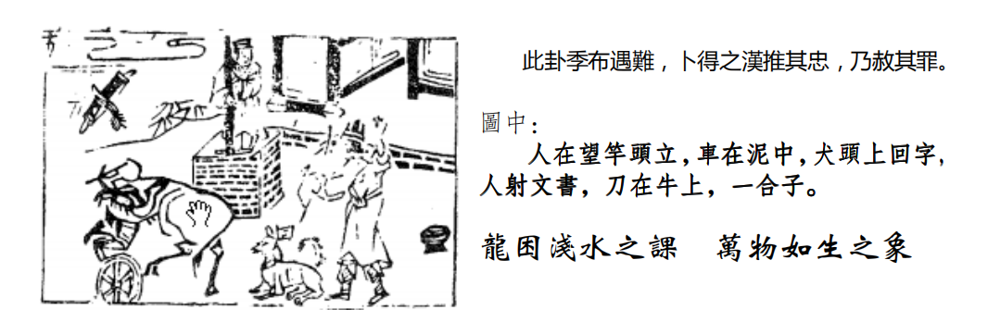

# 天纪05 象数易经

首先呢，诸位看，我们前面介绍了乾为天，后面介绍坤为地，就是天地定位之后,有天有地以后,开始了,所有世界上的万物都是夹在天地之间,物之始生，物啊，任何东西，刚开始出来的时候，就是屯!
所以易经就是这样一个个动作推下来,我们先定天的德,地的性,定了之后天地之间，开始第一个爻定出来，有天地之后，第一个出来是屯，屯的象，因为物之始生,阴阳刚开始交，叫做物之始生。如果阴阳始交,未成泽,就是屯的象。如果已经成泽，就是雨都下来了，掉在地上，一个水洼一个水洼的，已经成泽，就是为解卦。
如果天地的阴阳不交，完全不交，否
所以阴阳始交为屯，已经交了以后为解，阴阳不交的时候就是否。

## 水雷屯

那在人间来说，刚好逢到天下屯难，未亨泰之时也。

诸位不要忘了，这个水雷屯。卦呢，指的是事，爻指的是事之时也。事的时机，很重要。
现在我们介绍水雷屯卦。上面是水，雷呢，初阳。
上面是水，下面是雷，这是物象，卦的象，所有的交呢，是事的时机。我们可能从这个爻入手，也可能从这个爻入手，凡是你这一辈子遇到屯的时候，就是说没有亨通的时候，你不了解，物之始生嘛，包括刚开始进一个公司，包括你换了一个新环境，完全不了解的时候，都属于屯。那你有时候接一个位置时，有的从最低开始干，有的从君王开始干，进去的时机都不一样，我们用的态度统统不一样，这是我们以后介绍爻变的时候，重点在这里。

上面是水，下面是雷，这是物象，卦的象，所有的呢，是事的时机。我们可能从这个爻入手，也可能从这个爻入手，凡是你这一辈子遇到屯的时候，就是说没有亨通的时候，你不了解，物之始生嘛，包括刚开始进一个公司，包括你换了一个新环境，完全不了解的时候，都属于屯。那你有时候接一个位置时，有的从最低开始干，有的从君王开始干，进去的时机都不一样，我们用的态度统统不一样，这是我们以后介绍爻变的时候，重点在这里。
屯卦呢，以卦体而言，这个水就是坎卦，是险，诸位以后看到坎，看到水，就是险，雷呢，代表震，代表动，动的象，卦体是照样，外卦是险，内卦是动他整个卦就是:心里面想动，可是外面是险，外险内动,遇到这种情形,你想动，而不明了外面的时机,所以屯卦就是要告诉我们,要坚心,在哪里呢,以明而动。不明而动，则动于险中。不动还好，一动就危险了。当然选择不动啊，不动比危险要好啊。

我们老祖宗看到物之刚开始的时候，对外不明，所以呢，易经里爻辞写了，利建侯,诸位以后看到这个利建侯,就知道屯之时呢,要去广结善缘,广招辅弼，广结贤能的人，找资助，找辅弼的人才。这个是先不要动，待时而动。
那易经呢，如果你是初爻，第一爻，如果你是屯的时候，你刚开始进去的时候，你的职务是最下的，在下，从小兵开始干，易经说，你要盘桓，利居贞，利建侯，两个利。
我们晓得,这个阳爻,代表刚,阳刚,代表就算是再有能力的人,你刚开始，居于下位的时候，要盘桓，不要剧进，不要急于求进，很多人第一天报道，第二天就想干科长，第三年想干处长，就是剧进啊，要盘桓，盘桓的时候，为什么要这个利居贞，即使还没有得到你想要的，你要坚心，不能动，还有利建侯，广交贤能之人，这是始，第一爻的时候。但是盘桓的时候，一定要利居贞哦，这是一个原则。这个原则我们在天地里面就讲过了，要有刚，要有你做事的原则。
有一句话，君子和而不同，小人同而不和。为什么，就是君子有他自己的原则,就算今天发生冲突以后,我们事后和解,但是我不能改变我的原则,小人呢同而不和，如果有了纠纷产生了以后，小人目的就是要钱，一旦给钱了，好好，马上和解了。君子不会，一定要对他的行为负责。

如果我们的东西被人家 copy，这个一定要告的哦，原则问题，我告你不是为了你的钱，要教育你，智慧产权，你给我钱我也要告你，如果你给我钱我就不告了，那我就是小人。自己的原则都没有了，你告他的目的是什么，教育他啊。所以一定要利居贞。
后面还有一个他的象，一爻，有个原则，叫以贵下贱，大得民也。以前我们有一个人做到了，谁呢，严家淦，严家淦先生很好，怎么讲，他就是盘桓，他刚到省政府报到，不了解里面的人啊，屯啊，他以贵下贱，他对他下面的人，不要说职员了，他对下面的工友都很高兴，对他很好，对他很尊重，你好我今天来这里报到还请以后多多照顾我多帮帮我谢谢你。他离开省政府的时候，他跟每个人都握手，包括门口的工友，谢谢你我这几年都是靠你们帮忙照顾，有空来看我。这是什么，以贵下贱。
六二，易经上面讲六，代表阴，你别真的来个六啊，易经上面讲九，代表的是阳,六二的意思就是说第二爻为阴,像这个第一爻为阳爻的话,也可以叫九一。或者初九，初爻为阳爻，以此类推，这个叫什么，九五!所以是君王的位，九五之尊!

如果你是将，你是一个银行的经理，换到另外一个银行去当经理，你去的时候，里面的人你通通不认识，也是屯的意思，处在这个时候，易经也说了，如果下面有很多手下，要屯如如，乘马班如。匪寇婚，女子贞不字，十年乃字。

这都是易经是原文，为什么是这样子，我们在易经上面，135 是阳位，246呢是阴位，你是第二爻进来，今天你在这里干主干、干科长或者经理，结果呢，你下面是阳刚的，水雷屯嘛，你不了解，你完全不了解，遇到下面是阳刚的，因为你本身不是很了解状况，没办法帮助自己，没办法做决定，这个时候，又遇到手下刚，一定要你做决定，这是讲这个第二爻的时机，那屯的话，讲过了，你一动就在险中，你不了解，你做的决策，为什么说匪寇?匪寇就是非礼而至，我请你来我家，你来了这叫着礼;我没叫你来，你冲过来了，这叫匪寇，诸位，即使他是寇，婚媾?为什么婚。如果是下面逼着你结婚，好像逼婚，从来没见过没来往过，好了，爸爸妈妈兄弟姐妹都逼着你结婚，你就夹在中间，也是属于屯，被刚所逼。这就是所谓婚。女子贞不字。坚心啊，不做任何决断，即使是寇，即使是婚姻，不要动，为什么说十年乃字。如果你做错一个决定，要十年以后才能回头啊。为什么是十，十是数之终。过了十就是回头回到一了。所以十最大。这就是告诉诸位，一念之差，所以我们算命时候都是十年一个大运，这人很好玩一个年，我现在干公务员干得很起劲，干到第十年就软下去了，已经疲乏了，人很奇怪，职业倦怠刚好是第十年，我们常常算命也遇到这种情形，他如果是金四居，逢4其运，14-23,他来找我算命,刚好是 34、24岁,如果是火六局的人,他刚好就逢六来找我算命，他每次都逢六来找我，刚刚好要换的时候，或者是运尾，刚好交接的时候来，那中间的话他不会来，这很好玩。
我们看这里，也是十年乃字啊，十年了就跑来了。很好玩，就在这个点上，他为什么早不来晚不来算。
六三呢，第三个位置是阳位，结果是阴交，阴居在阳位，那这三个是动上面三个是险，那是不是这个第三爻跟险最近啊，所以易经给六三下个定义:六三，即鹿无虞，唯入于林中。君子几，不如舍。往吝。吝就是咎、悔恨，意思是说，当你到了象的位置的时候，你发觉上面是险，跟你的君王之间有一个阴的爻夹在中间，代表你的想法、好意、忠心，没有办法直接传到君王的耳朵里面，因为君王被群阴所包，你跟君王之间隔着一道阴柔，了解我的意思把，结果你很好的意见给他，他拿去给君王就变质掉了，这个时候怎么办，这个时候易经说，就好像即鹿无虞，这个虞是向导，你到树林里面去打鹿，结果你没有导游，鹿没打到，自己迷路了，遇到这样的情形，我们晓得前面是有险，对不对，如果没有导游，君子宁可舍掉，你不要想办法从这边跨越过来到这边来，越级，以为很好结果会受到伤害，你的信用也受到影响。即使你当时能成，这个阴也会说你为什么跨越过我，遇到这种情况的时候，不如舍，就是舍掉。易经告诉我们进退取舍之道。舍掉，不要干了。再往前走，就一定会得到悔恨。你一碰到这种情况，马上不要干了，马上离开，你要是不信邪在干下去，就往吝了，遭到纠纷。

那你如果再进一级，六四，易经说:乘马班如，求婚，往吉，无不利。为什么这么讲，六四这个是阴爻，因为近于君，为什么这个是屯，屯的意思是你不明，你如果进去的位置，刚好你爸爸是董事长，你是总经理，你不明了情形，对不对，你一进去，就是这个象?乘马班如，求婚，往吉，无不利。为什么说求婚媾,不是真正去求婚哦,而是说你要真正去了解情形,代表你的才能不到那边，要用贤人，到手下去发觉贤人，求婚，好像求结婚一样，去发觉贤人，找贤人来辅佐你，所以每个位置有每个位置不同的做法，如果两个经理，你刚好进来这边,他刚好进来这边,结果他要跟君沟通要经过你,结果你正在找贤,他不干了，他离开，赶紧把他找回来，贵人呢，君子、人才，难进易出，他为什么赶走，他到哪里都有工作啊，小人易进难出，你赶他都赶不走。所以第三爻这个人要这个人的立场，第四爻这个人要有这个人的立场，那你要考察下面的人是不是贤才,你考研他们，故意做成坏人，故意装傻，让下面所有人的意见反映不到君王那边去，你看离职不敢的可以把他抓回来，还继续呆在那边的就是小人。这是辨识君子小人，64个卦讲完了，整个人间道就出来了。这是六四爻的意思，因此如果你处于天子之下最大的，宰相之位，一定要举用贤才。你不明了，一定要举用贤才。千万不要太相信自己的能力。

如果进入九五，来这个公司，一进来就是董事长，易经辞曰:屯其膏，小贞吉，大贞凶。为什么要屯其膏，因为你居于君王的位置，你会发现到一点，因为你不明嘛，你会发现，你的政令下达大家时候，最下面的平民并没有收到。中间都是阴柔啊，三个阴交挡在中间，你在这里，他阳奉阴违，你说给这个工友加薪一万块,结果到工友那里手上根本没有。那你以为已经有了。这是屯啊,小贞吉大贞凶，为什么?改革的时候，因为你不了解下面的手下如何，改的时候，小的地方可以改革,大的地方先不要动,先不要改,因为屯嘛,你还不明了,你一动,大动就会凶。小的地方改就可以，无关痛痒的，稍微动一下，为什么要小贞吉，要动一下代表说，我有权利哦，告诉你哦，权利在我手上，你动一些无关痛痒的事情。

如果你发现这种情形的时候，当你发现到，你的政令无法下达，代表说你的权利已经移转，如果你很急，骤正必凶。你要马上警惕到自己的权威没有了，了解我的意思把，如果树立你的权威，先改小的嘛，小的动，大的不要动。马上想办法把你权力弄回来，就招凶。
遇到这种时候，改小的，要慢慢地收回来，渐渐地收回来，不要太急，所以杯酒释兵权啊。你不要说还回来不还我就干掉你，手下就反你。想尽办法慢慢让你的政令下达，权力收回。政令下达，上下就通顺了，当你是君王之道，屯难之时，最好的方法就是这个。
有的人，过去有句话，周王那时候诸侯权重，鼎还在朝都，有一次楚国的使节就问九鼎一个有多重，叫做问鼎轻重，必叛。如果你有一个朋友来问你，请问你你有多少钱，这就叫做问鼎轻重，这种一定是小人，你管人家啊?我曾经骂过一个小人，他在后面讲我坏话讲了十年，他在结婚前跑来问我，他问你知不知道我的未婚夫银行存款有多少钱?问鼎轻重。如果你是律师，如果有个人来问你,请问你什么时候考上的，办过多少案子，这就叫问鼎轻重，知道吧，尤其是你的手下来问你，必叛，要注意，履霜坚冰至哦。这是我们老祖宗告诉我们的。

所以，处屯之时，特别要谨慎。
那到了九六之时，第六爻的时候，上六，最上面是阴位，是阴，柔，阴柔居，屯之极。这就好像，险极又无援。很危险又没有外援的象。
上六的爻辞怎么写:乘马班如，泣血涟如。到了第六爻的时候，你还是柔就不行哦，你是君王，你是刚的，一定要进入刚的，九五是刚的位置，一发现不对，马上要去掉，不去掉就履霜坚冰至，到了第六爻，你还在柔，好了，泣血涟如，懂不懂我的意思。这是险之极，孤立无援。他的结果是什么，泣血涟如，有大的变化，对你伤害很大。血泪都哭出来都没有用。
所以上六，这个爻，一定要有阳刚来住，用贤乃解，贤要用阳刚之人。这个阳刚之人，包括你在法律上，是阳刚的，或者是领导力很强的一个人，这个阳刚之人是一个形容词啊，不是一个名词啊，代表一个个体。一个政体。你不要找黑道来解决啊。这个阳刚代表政体。法院是正体，警察局是正体。那君王没办法，他求外援，对不对，找美国帮忙啊。就是这样子。
所以说，如果到了屯的极限，你不知道怎么为，就很危险，你赶快要外求就不会有事。
诸位看这个卦上的图解。

上面有个人在望竿头，有个车子在泥中，看不到泥，但是原图是这样子，犬上有个回字，人射文书，刀在牛上，一个盒子，诸位看这个图，要读图。
人在望竿头上立:不明局势,局势不明,屯难之时,一ト到这个卦,告诉他,不可妄动。绝对不要妄动。那你说不能妄动，那做什么事情呢，利建侯!广结善缘，多交朋友。各位要交朋友可以找我，什么人都认识。
犬上有两个回字，哭，你一动，就泣血涟如。第二个呢，是指属狗的人，还有呢，还有姓里面的狄。
车在泥中呢，进退两难。
刀在牛上，是不是这样写啊，解。

所以牛为贵人，这件事你要找属牛的人，是你的贵人。哎呀，我哥哥属牛那找你哥哥去，找你哥就是利建侯嘛。
一个人在射文书，后面很多图里面都有人射文书。第一个，拉弓长生而射是张姓的人，也代表小人阻碍，因为我们一个卦有很多不同的细节，可以解释这个文书，这个命令，应该很快到你手上，那有个人射箭来阻止你，那就是小人阻碍。C
还有张弓射，中国人的文字，从诗经里面来的，同音的，尔雅里面就是同音的，这是射，就是这个色，所以很多人在闹绯闻，你要跟他讲，你要小心哦，闹绯闻。
他来找你卜卦，又不信，这种人，就是活在事情发生之前，认为不可能，事情发生之后又后悔，世界上十之八九都是这种人。
有个人在那边望,如果卜疾病，人亡,望者,亡也,这个望字是不是这样写，旦夕而亡。快挂了，快走人了。

人立在那边，人立是不是位啊，意思说在位也。
这里画了一个盒子，盒子是先成后破。如果你卜到这个卦，如果你要动，他的结果,先成后破，所以，卜到水雷屯的话,告诉他,如果你要事情很快地解决，去找个属牛的，那你说我爸刚好属牛，那你赶紧找他去，你说我这辈子就不听他的话，所以你这辈子就是水雷屯。你懂我的意思吗。
盒子为什么先成后破，碗啊，是不是做好的，你用很久掉地上打碎了，这就是先成后破，那如果是衣服呢，衣服是不是先把布匹剪破，做成衣服，这是先破后成。
还有呢，你仔细看那个图，你有没有看到牛头上放把刀，它回头看那个狗有没有，这个诸位要看的很细腻哦。
牛呢，有的时候，会计无所出，待也。等待。结果你说你爸爸牛是解神，结果你找牛，结果你想想，说不行我要找那个关系人，结果一找，那个人就是狗。所以，整个卦的通象，我们卜到这个卦哦，八个字，动于险中，先成后破。

春秋末年的时候，越王勾践和吴王夫差，勾践十年卧薪尝胆，他用一个丞相范蠡，十年内把越国治理的很强大，把吴国打败了，范蠡这辈子做生意，八个字就讲完了，所以范蠡得到了易经的神髓。他说，人弃我捡，人争我与。他一说勾践说你这是啥意思，他说，天下发早灾的时候，我们去把船买回来，把车子卖出去，发大水的时候，我们把车子买回来，卖船出去。你想想看，你有500万，你拿 300万，在股票大家不要的时候，人弃我捡，你去把股票买回来，你有两百万，过日子也很好过了啊，当大家在抢股票的时候，你就把它卖掉，所以天下旱灾的时候，船没有人要，大家都抢车，你把车子卖掉把船买回来，没有人，船很便宜，统统买回来放仓库里，囤积啊，等到大水来了，车子没有人要，船抢手，你赶紧把车子收进来，把船卖出去。所以各位玩股票，股票大好的时候，应该是卖股票的。如果你没有股票卖代表说你不要进去，等到股票大跌的时候，大家都不要，好可怜哦，我去买一点好了。等到涨的时候，大家都要，我就给你们嘛我帮你们的忙。做点功德，八个字就够了。各位只要掌握这个精神，你比专家还厉害。

我们算命很厉害,算命是谈果的,我们卜个卦就弄的很清楚。诸位学过以后,千万不要拿不义之财，一个人财一辈子有限的哦，如果该拿三千块，你拿了二十万，改天你就出一个车祸，刚好赔19万七千块。包括你的车子，他的车子，还有你的身体健康在内。不该你的就不要去取。
哦，还有阳宅。水雷屯的象从哪里来的呢。二子是坎卦，长子是雷卦
次子居长子位，就是屯卦出现。

为什么我们要讨论阳宅上面，你住的位置不一样，你的念就不一样，你的想法就不一样，想法就会影响到做法。你可以试一下看，如果你有二儿子，你试着让他住到大儿子那边去，他就变成水雷屯了，然后你看，早上起来，他就在那边观望，看看大家在干什么，这是第一个，只要有书信来，好的事情，比如你婆婆打电话来说来吃饭，刚好是你二儿子接的,好我知道了,他就不讲,不说,屯啊。他说她请我吃饭就好了啊，关你们什么事啊。他想法就改变了。
礼记讲什么是孝顺，好像牛，按照道路走，顺，牛回头看，背道而驰，所以你叫他朝东，他就朝西，会背道而驰，那你很火大，背道而驰他不听你的，你打他，他躺在那里就哭，很难管，为什么，越位，位置不对，名位不对。这是大儿子和二儿子，同在一个屋檐下。如果有一种情形，大儿子、二儿子分开来住，大儿子和爷爷奶奶住在一起，二儿子跟外公外婆住在一起，那就不要管了。同一个屋檐下，才有长子次子之分。如果两个兄弟分开来两个房子住，都要睡东边，都是长子，都是东宫，马上要补位。这是一种还没有结婚的部位。

还有一种，当你们家同住一个屋檐下，当大儿子结婚了，不管他住不住这个宅子，大儿子就不叫长子了，叫丈夫了，移位住到西北。二儿子要补位变成大儿子，然后长子和媳妇住一起，然后父母要退位出来，住到三儿子这个位置，天山屯卦，屯是退隐的象，那父母亲住到三儿子的位置，就变成大儿子和媳妇，把爸爸妈妈当成三儿子一样的宠爱。这个就是孝顺。
所以年轻的夫妻对子女很有耐心，对父母没有耐心，拿对子女的耐心来孝敬父母，这就是孝顺，是易经的解释。那礼记的解释，是把你骂成畜生一样，现在很愚孝就是照样的。你不要看到书就以为他对啊，看他有没有道理。易经比较有道理哦。这是三代同堂。那如果你说我有三个儿子,那你就盖个四楼,全住乾方，长子还是住东宫，还是可以住，所以以此类推。

那我们这是布局，最好是在立基的时候，造宅的时候，刚开始盖的时候就设计好。先问业主先生哪些人要住，名字列出来，爸爸妈妈爷爷奶奶等等，不要列张三李四王二麻子。这是屯卦。
我们在观屯的象的时候，如果他位置住错了，我们在批八字的时候，要做加减，以后我们卦介绍完了，我们后面进度会慢慢加快，大家对卦熟了，我们就进度加快,到时候我们天文地理放在一起看,那屯卦如何做加减,比如他的命中看他的二儿子命里是 28岁结婚，结果你不晓得阳宅，二儿子住到东宫上面，结果26岁就结婚了，你懂我的意思吗，他提前了嘛，结果他大儿子住坎位，结果哥哥听弟弟的。弟弟变成大儿子，然后呢，变成弟弟结婚，哥哥还没有结婚，这世界上这种事情太多了，对不对，不然你告诉我为什么，找不到更好的理由，就先听我的，先迷后得，先假设是对的，然后去验证。

## 山水蒙

从屯,水雷屯,物之始,古代圣人授之以屯的时候,屯之后呢,开始有智慧智慧开始了，就是蒙。山水蒙完全谈如何启蒙。你是笨蛋，没有关系，启蒙的方法对就好，所以启蒙的技巧很重要，所以各位能够把山水蒙的卦意了解，你如果了解的话，你就是大智大慧的人，启蒙呢，为什么说蒙，是山下有水，这是水雷屯的续卦，一步步进来，小孩子先生出来，在妈妈肚子里的叫做屯，一生下来呱呱落地，就是蒙了，为什么叫做蒙，从卦体来说，上面是山，下面是水，山下有水，遇险而止。这个水是不是险，一个人，遇险而止，莫知所之，蒙象也。蒙的象。

这是什么意思，我们一个人，出行，遇到险，一看到不对，停下来了，你在犹豫,就是蒙,懂不懂,所以世界上不是说任何什么事情都是很清楚,这个时候,如果能够拨蒙，那瞬间就能看的很清楚。有的宗教家天天念经十年，也不一定有这种蒙的智慧,宗教家常用一些咒语和经书来让你发蒙,诸位如果能够了解易经,不需要这些外在的东西。

你只要看到一个人,遇险而止,不晓得往哪边走,这就是蒙的象。看到前面,你不知所措，你自然会停下来，因为你没办法做决策的时候，自然而然会先停下来，这是人的本性，这就是蒙。蒙的象。
易经上，山为止也，水呢险也，山水蒙是外止内险，易经说这就是山水蒙外面是停,不知道怎么办,里面是险,担心担忧受怕,不知道怎么办,那就是蒙。诸位，当你有一天在家里面,突然说,怎么办,有事情来了,不知道怎么办你不敢动，这就是蒙。蒙了就要找启蒙，术业有专攻，比如说这件事情是因为官司引起的，你要找专家，这是讲蒙的时机、意义。
易经第一句话就讲，蒙啊，匪我求童蒙，童蒙求我。初告，再三，则不告。利贞。

这是发蒙之道。这个怎么解释,小孩子的蒙,叫做童蒙,你会发现你的儿子、女儿，你发现他，他现在心里想，我要一杯牛奶，然后他来找你，你把他扯到其他的扯了半天，他还是我要牛奶。童蒙，他坚心，不是我找这个小孩子，是这个小孩子来找我,是童蒙,是最好的蒙,最好启蒙的就是童蒙,后面还有很多种蒙，还有笨蛋的启蒙方法。
小孩子来找你，他心无城府，平常心，他不懂，他就要问，他就一直在问S童蒙，这个最好启蒙，你就告诉他。
那有一种呢，初笼告，他来问你，你告诉他了，讲完了。什么叫再三，一再反复地问你同样的问题，就是他不懂，你讲了，但他不懂，他没有收到。
比如，有个小姐找我，倪老师,你看我考试能不能过,我说上,我就讲完了她没有收到，她还说为什么能上。我说他要赔钱，他还问你为什么赔钱。一件事情重复在那边问你，就是没有弄懂，遇到这种情形的时候，则不告，他反复问你，你不要告诉他，而且要坚心地不告诉他。

所以我常跟客人讲，我回答你一次哦。讲完了。第二次你再问同样的问题我就返渎，前面讲的没有收到，易经发蒙之道。坚心!你越不讲，他越按照你的做。

现在很多太太小姐去劝人家，所以诸位以后去帮人家启蒙的时候，一句话就讲完了，比如说你算到一个人的大限到，你跟他好言相劝，我告诉你哦你千万要相信我们什么什么的，所以这样做会对你很好，我告诉你，讲完了他根本不听你的。为什么，他反渎，你也是啊，你一而再再而三地讲,他也不听,你也是反渎!他也是，两个返渎碰到一起。碰到我呢，先生，死!完了。他会追到我来，童蒙求我啊，啊死那我怎么办，他想要了，那我就告诉他，解掉了。两三句话我一下就把他解决掉了，你们呢，花了三个小时讲，他还是不信。我就一句话，大限到了，死!赶紧回家，他赶紧追着你问，马上变童蒙。因为他年龄很大，已经是成蒙了，所以我们的初中高中教育有问题，其实就是要保持平常心，保持童蒙，很开朗地来问你，你有什么好问的，你不问，是你放不下自己的身段。孔子、尧舜都不耻下问,他之所以为圣。所以你发现小孩子很可爱,我发现小孩子很好沟通就是他是童蒙。一看就开朗，什么话就直接讲了，最好，拐弯抹角讲，就不要理他了。我有一次我跟朋友在一起，我讲错一句话，朋友小孩子就从头到尾追问到底，最好，坚心啊，大智慧啊，可是他爸妈说你别将不好意思，其实是好事啊。你看那个小孩子在那边，他坐一个小时，玩玩具玩的很专心，你把他拉开来，他还是想着要去玩。你有没有办法做到每一个小时每一分钟都专心做一件事情，很难，你做不到，为什么，因为你已经不是童蒙，你已经成蒙了。后面蒙有好几个阶段，诸位想办法让他自己变成童蒙。诸位来学这个班，先把自己变成童蒙。最好，童蒙吸收完以后，再去判断。
这是蒙卦，你启蒙的方法是对的，大吉哦。蒙卦是吉卦。有的人已经进入蠢的阶段，就很难启蒙了。双目似睁未睁，两眼无神，眼睛好像打不开来，诸位看眼睛的相,眼睛不在于大小,眼睛在乎有神,眼睛似睁未睁好像打不开来的样子。然后两眼无神,这是蠢。这个平常我是没有那个菩萨慈悲心肠来给你开蠢,开蒙所以我碰到蠢的，我立刻不讲，讲完了我就走人，这个很累。

比如手我们好心跟他说要这样子，他说真的吗，他还在怀疑，这就是蠢!这种人我看的太多了，所以说我们要注重观察，我们给蠢下个定义，因为他不知道哪里是对,他自以为是,诸位,术业有专攻,你不懂,你就问人家,这就是童蒙有的人呢，半瓶子水叮当响，他读法律的，他研究的不是这个，然后他在那边卖文章啊。半瓶子水,遇到这种最累,我们宁可去找一个,任何一个不管什么专业,完全不懂的最好，懂不懂我的意思。那个懂的弄了半天，还要先把杯子洗掉再装水进去。找麻烦啊,你又不欠他。所以不要变成蠢蛋。双目无神这种人都是悖的,学而不思，思而不学。学了以后，要用自己脑筋去想。
好，我们下节课接着上。
