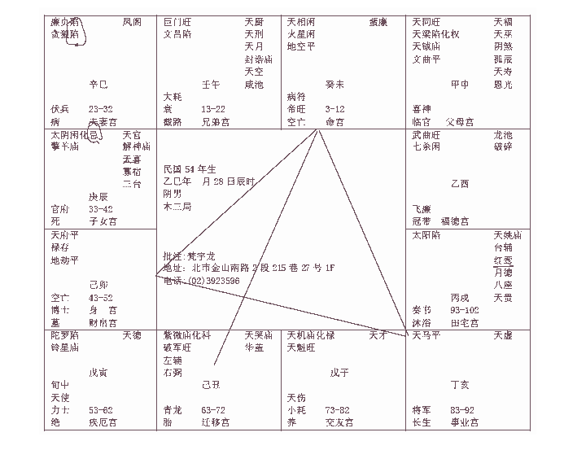
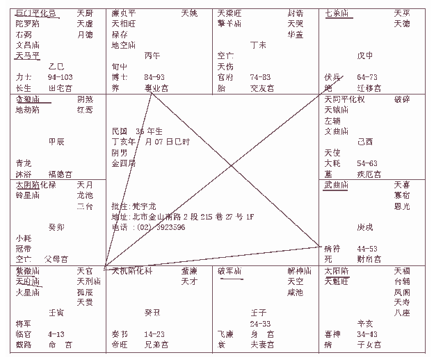

# 天纪06 紫微斗数 紫微星在丑

介绍下一个案例之前呢，我们先介绍几个方位的观念。方位之前，先讲一下样东西:
第一个，子午卯酉，偏左，或者居中;寅申巳亥，偏右;成丑未，大大老光这就是说，我们有时候碰到客户，八字搞不清楚，他说五点钟左右生的，什么答案都有，你问他几点生的，答案很多，有说我爸爸早上喂猪的时候生的。我有一个方法，看后面的发旋。如果你是子午卯西生的，发旋是在中央，或者中央偏左。如果你是寅申已亥出身的，发旋一定偏右，所谓偏左偏右从后面看。如果是辰成丑未生的，一定是双旋，两个旋以上，这是我们用发旋来判断出身时间的关系。

第二个，我们方位上的问题，方位上，卯时正东，午时正南，酉时正西，子时正北。诸位只要先知道正向就好了。可是我们实际上利用阳宅的时候，十二个宫，就是十二个地支，子丑寅卯辰已午为申酉成亥，我们把八字合到阳宅上看的时候,只看这十二个宫位而已,所以罗盘,以后到一定程度我会让诸位去买罗盘,罗盘买回来，上面有 24个分金煞，实际上我们用在阳宅上，就是十二。其他多余的，我们用来看风水用的。看阴宅、山川河流。看房子的部位在整个大自然的位置。这是看风水，房子内部的叫地理，叫阳宅。
诸位来看第二个案例:

## 紫微星在丑宫

其他诸星都一样，当然科权禄忌要看八字，不一定永远在一起。那如果紫薇星在这边，旁边一定是跟着破军。

这边陀罗、天府，太阴，其他都一样的。我们现在举例上面，命宫是在未这里，我们先不看命宫在这里。假设命宫在亥宫这里，命宫在这里，本身宫里是空的，对面是廉贪，这个廉贞贪狼都落陷在这个位置上，廉贞贪狼不单单是落陷,如果廉贞贪狼有一天跑到亥宫这里来，也是廉贪落陷，这里有一个特别的格局。我给命名为:半空折翅,这种八字就是一种天罗地网,中年限,什么叫中年限呢30岁左右，我这边只是一个大概的原则，30岁，还要看流年，有的人29岁发生，有的人要到31/32岁发生，不一定。诸位只要看到廉贪在这里，或者在对宫，基本就是这个格局。会有天折的现象，甚至这个人，我看过很多，有一种是先天带一些病症，发病死掉。有一种人，是环境造成他，他没有病，他自杀了。都会有这种现象。碰到这个格局非常不好。

那如果按照这个命来看,你看他兄弟宫在午宫这边,先看命宫,命宫在这里，是坐天相，一般来讲，女孩子是天相星最好，天相是填上的宰相，是非常好的辅佐人才。天相的人一定是位高无权。这个天相落在命宫的人呢，他从来不去想权位,他是很好的辅佐人才,这是命宫坐天相。天相的人呢,比较瘦高,瘦瘦高高，高挑形，那如果有个人呢，他的天相是45-54岁大限，意思就是说 45-54岁这个限内，他处于位高无权的状况。比如说干到行政院副院长，干不到正院长。他老是干副职。所以不单单是命宫，你要以此类推。如果流年遇到这个，也是以此类推这样批的。懂不懂我的意思,所以批八字要活用。如果你光看书,看不懂啦，没有用的，这样讲你就了解我的意思了把。

紫薇破军在丑宫，如果是命宫在这边，紫微星我一再讲过，紫微星一定要逢到左辅右弼，这个人就是左辅右弼在，看到没有，如果命宫在这里的话，好，我们不要管什么命宫，光讲这个宫是紫薇破军还有左辅右，诸位用想的，推理。我们知道紫微星碰到左辅右弼非常好，非常贵，那对这个八字来说，他刚好落在迁移宫,对不对,换句话说,这个八字到外地去是不是比在本地好很多。反过来如果命宫在这里，是不是，在本地比在外地好很多。所以格一样，宫不一样，批起来是相反的，对不对，这是批命的原则啊。所以斗数易学难精就在这里。这很简单，就是这样子看。

那请问你，如果这个北斗星君加上左辅右非常好，如果落在夫妻宫呢，那代表他的另一半，如果是女的，她的先生很好。如果是先生的话，他的太太非常的优秀。了解我的意思把，这是非常好的现象。至于怎么好，以后我们举例的时候来批整格，我现在是在讲如何批，我们十二张介绍完，紫微星落十二个宫，我们开始有很多好的例子，好的八字，批给各位看的时候我们再讲。
那这个人的夫妻宫呢，刚好这个八字夫妻宫是在廉贞贪狼，我刚才讲过，廉贞贪狼是天罗地网,也是半空折翅,对不对,那我们怎么解释,我们星辰这么多什么星不好，怎么搞得廉贞贪狼两颗大桃花星落陷坐在夫妻宫，我讲过，贪狼是酒色财十足的星,刚好又聚在夫妻宫,是不是他的婚姻就会很差,你不用看别的，你就光看这里，就就会有预感，这个人的婚姻不太好，有问题，配偶的问题一定很大。

所以廉贞贪狼落在一起的时候，我们有廉杀，廉破，廉贪:廉贞七杀呢，半路死亡，半路埋尸;
廉贞破军呢，水中作家，水中作坟墓;
廉贞贪狼呢，横天。廉贪偏向于一种先天带来的疾病，也就是生下来就有一种治不好的病。还有一种自杀的倾向。所以我们杀破狼这个煞星，再遇到廉贞星的话，煞会加煞，知道不知道有的人就是死在水里面，他不是想不开，谁愿意，可能被杀了丢到水里，或在岸边钓鱼掉水里。
那有些人，半路死亡，还有这个，这几个星，都是死!
那如果是入庙，庙旺的意思就是说煞星很亮，代表你的眼睛看的到煞，你家隔壁失火了，你看到了，你会去救火，会去预防，所以煞星很亮代表凶处藏吉。

煞星不亮，就是你根本没有预警，叫做吉处藏凶，在劫难逃。这就是八字里面的凶处藏吉以及吉处藏凶的精义在这里。

所以你看到煞星落陷，就是你看不到的煞，你无法预测的煞，了解吧。看起来外面是好事，其实是凶事在里面。
所以煞星进来的时候是亮的,没有关系,落陷的,看不到的,那是最可怕的，小偷给你看见了就不叫小偷，叫强盗了。强盗不叫重啊，所以他跑掉了。这就是庙旺跟落陷的关系。
好，诸位看，这个太阴星在子女宫这里，是辰宫，是上午7-9点，辰时，刚好在子女宫，这个太阳星在田宅宫这里，诸位看这个八字。这个化忌在这里。太阴这里是白天，等于是白天出月亮，太阳在夜间出太阳，刚好是反过来的，这叫做日月反背。日月反背有几个重点:
第一个,他工作白天黑夜颠倒,披星戴月,晚上比白天还要忙,有很多行业，晚上才开始忙的哦。

第二个，六亲不靠。靠不到父母亲，日月反背。
第三个，性情非常刚燥。你想想看，如果是命宫在这里，自天出月亮，那个白天只能是太阳，他却指着说这是月亮，就是形容这个人很固执的意思。
那如果是在子女宫化忌，又是反背，那你想想看，这个儿子，没有!这是一个，这个八字我给你批出来，所以紫薇在丑宫，会有日月反背的现象。
好，这里还牵涉到一个重点了，诸位看这十年，23-32岁,33-42岁，我们先看，我跟诸位讲过，未来十年无大运，大限前十年!我们先看十年十年一个段落，33-42年，日月反背，化忌，没有大限，那大限就在23-32这里，连续两个二十年煞，你懂我的意思吗，23-32，我们晓得是廉贞贪狼，半空折翅，很危险;33-42日月反背又化忌，差不多就完了，人生乏味，我可以走了，再一看他的煞都在夫妻宫，还有什么，子女宫，这是煞到婚姻，那一个女孩子，这辈子我的事业就是我的先生，我的孩子，那都这样了，人生乏味啊，对不对啊，会想去自杀。所以她从 23-42岁这二十年中间，她婚姻也不好，子女也没有，她没有办法，没有精神的依靠，所以她廉贪在这里，大限在前十年，32岁那年可能会想我不想活了。既然过得日子不愉快,死掉可能是一个解脱。就会有这种倾向。所以，如果我们今天只是算命，我们在23岁以前来算，和42岁来算，我们算命的结果是一样，所以我们看中国的天文地理人事，易经就是上看天文，下看地理，中察人事，天地人三才，她是 23岁以前找我们算，和42岁来找我们算，完全不一样哦，我们可以让她这二十年凭空不见了，排的时候要排，不要说因为是你的兄弟姐妹，擦掉，装作没看到，等到事情发生了再去解决，这都是可以解掉的，这几个凶星要注意。
诸位看她的疾厄宫，陀罗落陷加铃星，疾厄宫是不是在寅宫啊，第一个，本来寅宫就是很煞了，寅是什么，内脏是肺，外科是右脚。

第二个，你看她的太阴星在辰宫化忌，有没有，所以她的胃一定也不好，那巳宫坐廉贪，脾也不好。按照中医的观念来说呢，很惨哦，中医的观念，忧能伤肺，思能伤脾，所以诸位有时候感冒咳嗽，很奇怪，怎么咳嗽两三个月还没好那是你的外症啊，实际上你没有想到，你在担忧事情，很紧张，很郁。还有思能伤脾，思虑太重了伤到脾脏，我们的胃跟脾是同时运动，胃一张大脾就缩小脾以张大胃就缩小，那你思虑太重了，像梁山伯，脾脏就死掉了，胃也不懂，东西吃不下去,所以恋爱谈的很深,思念对方厉害的时候是吃不下东西,味同嚼蜡。酸甜苦辣吃下去没有味道，因为伤到脾了。
你看看，一个女孩子，婚姻非常不好，再加上子女非常的不好的话，她是真是如同嚼蜡。尤其遇到这种廉贞贪狼,她就算先生没有死亡,也是如同死亡一样，命上面就看到了。

如果我们去看她的阳宅，命运同参的时候，非常厉害，阳宅上面来看，东南西北，厨房在西北角，这是死别。
西北角的话，死夫;如果厨房在西南角，本人死，她自己死掉了。你懂不懂我的意思，知道为什么?西北是坤地，这是个女孩子的命嘛。西北角是夫，懂不懂我的意思，哦，这是男孩子，抱歉抱歉。如果是西北角是本人，如果西南角死太太。那这个是男人，娶这个太太也很惨啊，遇到这种情况，如果我们讲算命今天没有讲人间道和地理，对他说，算了，你放掉你太太算了，反正她喜欢去什么地下舞厅啊赌场啊，会这样子哦，这是积重难返，很累的，如果这个命是个女孩子，这个先生就完了。
那到底是生离还是死别，决定在阳宅。西北角是厨房，死先生，西南角是房死太太。如果房子西北角是客厅，不是厨房，如果这是个男的，就是他本人跟他生离，客厅主的是生离，有没有介绍过。好，没关系，今天介绍。

客厅在易经上的象，客厅嘛，象客人。如果房子东南西北，如果你家东边是
客厅:
有两种情形，第一，夫妻住进去以后生不到儿子;第二种，有了儿子以后住进去的儿子变成客人。结果你会发现很奇怪，以前家里住的儿子很孝顺，结果换了一个房子，很奇怪，儿子在家里如坐针毡，他就想到外面去，打电玩啊，出去玩啊，或者跟一些不良少年到公园里吸安非他命啊，客人!儿子变成客人。
那如果西北角是客厅，顾名思义，是丈夫的位置，丈夫等于客人啊，把家当酒店，有几种人是这样，比方说先生当船员，飞行员，这些都是客人，有些小姐家里是这样房子,我说你在窗户挂个牌子叫做某某氏大旅馆,先生就像客人一样。然后我们看过很多，干军人的，警察的，船员、飞行员的，西北角都是客厅。因为西北方是夫妻的位置，如果西北方是客厅的话，主的是夫妻的生离，如果西北方是厨房的话,主的是死别。厨房我介绍过,厨房是肉放在案板上一刀下去的象，手术台上的刀子也一样。

同样以此类推，如果你的子女宫，东边是厨房，主的是长子天折那如果子女宫，在化忌，太阴化忌在这边，那我们知道，这种八字是没有儿子的，无子之命!那你说，不对啊，我现在有儿子,一般来说，这是男孩子的命,如果这个男孩子命中没有儿子，我们帮他算的时候，他是无子，但是如果他太太的命中有儿子，那么他生的儿子脸孔比较像太太。如果有一天他生个儿子脸孔像他，这个儿子呢就是主天折。就是命占一半。然后如果再去住个房子，东边是客厅的话，那是百分之百会天折。
那如何化解这个天折,第一个就是要阳宅的位置,东边改成卧房,改成东宫第二个,医学上的技术,他如果生了什么病,医学上帮他治疗。注意天人地三才人间道的一部分是占在医学里面。不然的话，我们不懂医的话，人家来算命，你说你儿子天折，死在心脏病，就算你算得很准好不好，他就是死在心脏病，你不要跟他讲死哦，你跟他讲了，他死之前，不愉快好几天懂吗，对啊，你要解决对不对，如果他39岁来找你算命，你说他59岁死于心脏病，他二十年就活在心脏病的阴影之下，结果真的死在心脏病上。要解决啊。

那你以此类推，如果这个日月反背，如果落在父母宫，又化忌，太阴代表妈妈，太阳代表爸爸，父母宫会代表父母亲不在身边，或者双亡，那到底先亡父还是先亡母，看印堂，那你头发刘海很长，我又不好意思叫你拿起来看一下印堂，告我性骚扰，对不对，看眉毛。左边是父，右边是母，以此类推，如果父亲走了，不需要伤感了，这个眉毛一定不动了。我们有很多的资料可以佐证。
还有一个。诸位看到这个地方，武曲和七杀在这边，是不是，所以说紫微星在丑宫的时候，这几个星一定会会到这里来，日月会反背，比如说，这个是官禄宫，太阴星化忌，这个人当官就毁掉了，那明明是毁掉了，你还对他说你去当官很好啊，你害他做一件他一辈子做不到的事情，你知道我的意思吗，比如说你不是当官的料，我逼着你去当官，考到50岁还没有考中科考，50岁后就不能考了啊，那是谁害的，我害的，我们算命，是要看他的角色适合扮演什么，告诉他适合做什么，好，以此类推，懂我的意思把。

好，这是福德宫，这是重点!武曲、七杀，这两颗星在一起的时候，诸位，要顾名思义，要想的，不要看书上。武杀会!第一个，是女子，逢这种武曲七杀，主孤单。你女孩子就好好在家里做家务好了，你去杀谁啊，就变成当武官，一个人去孤军奋战，拼命去做，这不是主孤单吗。

第二个，代表离祖，到异乡发迹。如果一个人出来，一出来，命里就是这个武杀会,他早年就会离家。如果他 12-21岁是武曲七杀,代表那个时候才离家。看他什么时候。
第三,如果是男人,武职大利!武官非常好,今天是干军人警察法官外交官。武官的人要逢到煞星才用。那武官呢，碰上文昌星呢，那他当教官，或者坐教书的。不一样。武官文相。
如果是商人,会到这个,主劳多功少。这两颗星进来的话,掌的是生杀之权，完全是权，不掌禄，不管财，懂不懂我的意思。那你是商人，碰到这种星，不是很累吗，商人嘛掌权要不要都没关系，只要我赚钱就好了，比如说我当董事长首先有一百个人，大家不要叫我董事长好了，每个月赚一百万我已经很爽了。我今天是盈利嘛，他求财不求权，看你是什么职位，需要什么东西。那遇到这种武曲七杀，他会不好。
但是武曲七杀比廉贞贪狼好多了，你懂我的意思吗，因为他至少不像廉贪落陷那么凶。

如果男孩子，福德宫是主一辈子，他是武曲跟七杀，代表这个男孩子个性很刚强，他不喜欢靠祖业，一个人拼命去做事。如果是女孩子的福德宫遇到武曲七杀，福德宫是最难批的，她一辈子靠他自己，这个人面大骨粗，孤鸾，孤单的凤凰，不会结婚哦。那你一看她的阳宅，就问他小姐你为什么没有结婚去住爸爸的位置。慢慢会陆续跟各位介绍。这是武曲七杀。
那如果我们以这个八字来说，诸位看，这个33-42，你看他的流年，是不是太阴星在里面，官府，带死，然后红鸾星天喜星，大家看这个红鸾星是不是在辰宫对位回来，所以他在 33-42岁这十年中间，我放大举例给你看，太阴星化忌，旁边还有小星，官府，死，这个宫，我们要去看对宫，对面是不是太阳，是不是太阳陷地，所以，他 33-43 岁这个大限十年:
第一个，我们讲过，他无子福。没有儿子的福，诸位想想，他要是人死了也就没有儿子的福了，对不对。
第二个，父母凶，主丧亡。父母亲要离开;
第三个，婚姻凶，男人的命，太阴代表太太，太太在这个时候化忌，婚姻一定完蛋。根本就不用看了，婚姻完蛋。因为他天喜星在旁边，右上角这里，是不是有天官，解神，天喜，天喜星在这里，红鸾一定在对面，红鸾天喜这个牛郎织女，喜神逢到化忌，他又是男命，又是太阴，所以夫妻一定不是生离就是死别遇到结果只有两个,生离和死别的话,如果我们做选择,生离比死别还要好一点。

那如果今天以前没有阳宅,没有人间道,光是算命,我们给他算,哎呀先生，你这个命很惨烈，您婚姻子女都不好，很简单，你43岁再结婚，你了解我的意思吗，你不要结婚啊，你到43岁再结婚不是很好，这是不是废话!你说晚点结婚好，这是你说的，就像台北市政府说一男一女恰恰好，他讲完了，你们统统可以做到?很难啊，周围的环境逼着他做，很难啊。所以我们往往算命给客户的建议，讲出来的话都是很简单，可是人家做不到，这就是过去算命的缺失在这里。你说建议 43岁以后结婚，这是你很好的想法，但是想法跟事实不一样啊。所以说这个是废话。
还有呢，算命有化解的方式，外面的算命，遇到婚姻不好的时候，男女都一样，因为六是个阴数之极，九呢是阳数之极。所以说，我们算人的命，婚姻的时候，命解:第一个，二婚的对象;第二个呢，长七岁以上。

有的人命理婚姻很不好,还没有结婚,到你这算命,你说哎先生或者是小姐，你找个对象离过婚的,跟他结婚,还有,年龄要相差七岁以上才行。那就不克了,这也是废话啊。这是一般外面算命的，但是我要告诉你，因为有的人命中就是这样子,结果他娶一个结过婚的,跟他相差七岁,没事!你懂我的意思吗,为什么，就是这个道理，第一个她离过婚，她理亏，本来脾气不好，也会忍耐，本来以前跟老公吵架敢出去喝酒跳舞的,现在不要意思去了啊,呆在家里面。还有一种呢，长起岁，本来我是先生脾气很坏，你跟我年龄差不多，你应该懂啊，我懂了你怎么不懂，如果遇到的太太是小你七岁，哎呀小妹妹算了，她还不懂事!同样一件事，对面的对象不同，造成态度不同。

## 合八字

所以算命的，他的逻辑在这里。你如果跟我差不多大，你应该哦，你应该知道哦。冲突就来了。
所以我们常常给人家合八字，看这两个人，八字放在一起，一看，居然这个八字是父女合，外面的形是夫妻男女，结果八字一看是父女合，哇，这个先生把他太太当女儿一样的宠爱，你看走在马路上,爸爸对女儿的态度跟对儿子的就不一样，儿子这样就一脚踢过去，女儿就抱在怀里，对不对，不一样。

那有的是母子合，有的是兄妹合。有的是朋友合。对啊，看你是什么状况所以我们在算命的时候，很厉害，我这样讲，诸位体会一下，因为八字的时候我们有命宫，命宫是天相，如果他还没有结婚，我们帮他挑对象，一挑到命宫就是廉贞贪狼，是不是刚好死路一条。
那现在我跟各位讲，合八字的精义在哪里?诸位要会哦，外面会算命还有不会算命的人，都误解了，包括很多算命的都不懂哦。
合八字，今天有两个人要来合八字，这个合八字跟八字合是两回事。合八字的结果，第一个是合，第二个是不合。那你知道不知道，合八字可以结婚;不合的八字，有时不合才可以结婚，你知道不知道。
我们看一个八字,一定要看先天之命,如果有的人,生下来,就是一世夫妻，找个八字合，太好了，就可以结婚了。
那如果有的人，先天就是二婚命，怎么办，你如果算个命天生是二婚命，你找个跟他很合，那刚好，他就是二婚了。

好，他的命宫是天相，你给他找一个廉贪落陷坐命的女人，你们两个太好了八字可以结婚，就惨了，对不对，很惨烈的。先天是二婚的人，我们要给他找一个不个不合的八字，才能够结婚哦。
遇到这种情况，他不合的时候，我们要看他怎么合，比如说，这个男的，如果我们给他找个女孩子,是他父母宫的命宫,刚好找一个天同天梁在命的女孩子刚好在父母宫，这代表是母子合。先生你赶快娶这个女孩子，这个女孩子将来对你将像对她儿子那样的宠爱。你看妈妈宠儿子的样子，你就知道了。
这个很奇怪哦，老公犯桃花，妈妈一定要管，儿子犯桃花，妈妈就笑一笑。
不晓得什么毛病。
如果你找一个人，他的太太是巨门文昌在命宫，那跟他是见弟合。听懂我的意思吧。那如果是天机天魁坐命的，跟他就是朋友合。

但是跟他找一个合他的时候，如果我们没有后天的阳宅去动的话，光是按照命走，你跟他介绍，两个人会处的很好，但是永远跟好朋友一样，就不会结婚没有结婚的念。那如果你找一个兄弟合,处一下两个人就跟兄妹一样,不想娶你，怎么办?所以我们后天有阳宅 push 的力量,但是这个是在命上面,我们来讨论。但是,我们临床上看有很多的经验,往往都是八字很合的时候,一看的时候，就看的很顺眼，不管婚后离婚不离婚，婚前看的都很顺眼，谈恋爱谈的很惨烈，一定要去结婚。
还有一个更好玩的现象，跟诸位讲，诸位以后看多了就知道。你说过去媒妁之言，没有看到给你合八字，相士给你看，还是你自由恋爱结婚，我告诉你，拿到八字还是一样，以前媒妁之言拿去合八字，一看合，可以，好，你们去结婚好了。他只是合八字,他认为八字合就可以了,所以刚开始的时候,两个人很对眼,哎呀你是我的白马王子或白雪公主，结婚了一个月以后就都黑了，都不白了。如果现在的自由恋爱，我们拿两个男女朋友、或者夫妻八字，一看，哇，一样啊，真是命啊，为什么他不挑她，她不挑他。

还有来自不同家庭的两个人，家庭完全不像，结果夫妻两个人在一起，夫妻脸，好像啊，头发换一下就可以，脸都是一样的，像到这种程度都有，来自不同的家庭，为什么，命!了解我的意思吧，
所以我们在阳宅上，天文地理配的时候，诸位要记得一个原则，命上八字婚姻没有问题的时候，我们就不要神经病去改他的运，不要改他，让他自然而言结婚,命上八字婚姻有问题,我们才去改他有问题的部分,所以算命只是一个工具,我们算命知道他有问题，我们把缺点补上去就好了，这才是算命的重点。补上去的方法,绝对不是画个符念个咒,你买个鱼缸买个风铃买个玉就好了,你买回去他的八字还是不合啊,还是很凶啊。你不可能说买个萧回去,他的夫妻宫就变了。化忌也没了，哪有那么厉害啊。那你买萧还不如买消防栓好了，都是消嘛。那个都是迷信的，没有根据的。

所以我们常常合八字，知道这个方法了。我给人合八字，最喜欢的是什么，是太太是妈妈，先生是儿子，两个人合在一起，刚好太太的命宫里的星，正好是先生的父母宫，啊，那个就很好了，先生偶尔在外面犯点错，妈妈看儿子嘛，没关系。所以有的太太会允许，有些太太绝对不能允许。

# 紫微星在寅

我们现在还没有批流年哦，先看格，不要急，先要会批。到批流年的时候，我们找案例，很好的案例，一年年批给诸位看。
紫微星在这里，我们先不管他在什么宫，紫微星在这里的时候，天府星跟他在一起，有没有看到，七杀一定在对面，这就成了一个格。
紫微天府在这个地方的时候，叫做紫府坐垣格。四个角就是垣。如果在这边的话，就叫做七杀朝斗。

如果命宫在申宫，对换过来，我们是不是要看三方四正，怎么找，很单跳三格过来选一个。
所以命宫出来，一定会到官禄宫，财帛宫，所谓三方四正就是命官禄财帛迁移，如果是紫府坐垣，或是七杀朝斗，这两个都是大贵的星，紫府坐垣的人呢他将来位列三台，他会在天子身边当个将相之人，就是宰相，因为紫薇跟天府在这里，君王!真正的君王不一定是紫薇天府坐命，以后也可以给诸位一些八字看一下。位列三台，就是以前的司空这种。
七杀朝斗的人呢，这种人是将星入命，有威震边疆，你想想，他如果命在这边，对面迁移宫是紫薇天府，他是不是到边疆去威震边疆，如果命宫在寅这里，当然就在本地吉，呆在天子旁边了。这样了解我是意思把，很单哦。
这是一个特殊的格，南北斗星君同时会到一起。
那如果这个不是命宫，如果这个人的官禄宫在这里怎么样，哇，那是大好，这两颗都是官星嘛，是不是。

那如果这是财帛宫呢，这两颗星是财库，而且并不是财星，只是有很大的权利而已，并不是很大的财星，换句话说，如果财帛宫在这里的话，他到私人公司好好做事情，股票上市公司，比他到公家单位上班来的好，然后在私人公司里面当总经理，比如他到台塑去当个总经理，公司并不是他的，但是他表现太好了，直提拔，平步青云上去，也会近天子之侧。所以他到底是去公家机关，还是私人公司，我们一念之间而已
紫微天府在这里，那太阳在亥宫，太阴在卯宫，诸位想，在成宫的时候，太阳已经很惨了，在亥宫呢，9-11 点，卯宫呢，是 5-7点，那一定是更暗对不对就是比刚才的还要加凶，如果，你以此类推，按照易经的象来推，如果亥时，刚好是田宅宫在这里怎么办?晚上出太阳，你家房子这么会晚上出太阳，好大的火啊!对不对，火灾!对不对，这个火灾怎么来的，用象批。

如果这个亥宫，亥时，不是田宅宫，是父母宫怎么办?太阳指的是爸爸，了解吧，以此类推。

如果是一个女孩子的命，亥宫是夫妻宫呢，太阳落陷地，太阳就是先生，看到没有。如果你看她的命宫，你看她的眼角，两根，没有第三根第四根，那她先生很好,你不要批她先生死掉,太太,您夫妻聚少离多,她先生可能是海员船员，很少回家，所以要看清楚哦。那这个女孩子坐你面前，已经面大骨粗声沙，你还说您夫妻聚少离多，她先生已经走人了啊。要招子放亮一点。就算你看不到相阳宅拿来看看也可以嘛。可以加减一下。要弄清楚。
那如果这个亥宫是子女宫，会有儿子，儿子远离，不在身边，化忌代表儿子要死，有煞星，羊陀火铃空劫，进入子女宫，化忌的话，一定是死。化忌，或者是羊陀火铃空劫，再落陷的话，就是煞了。各位要注意一下
那如果亥宫是疾厄宫呢，用象批哦，对，眼睛不好，你怎么把晚上的月亮看成太阳呢，你什么眼睛?青光眼啊，眼睛都看不到了嘛，日月反背。这样会以此类推吧。
