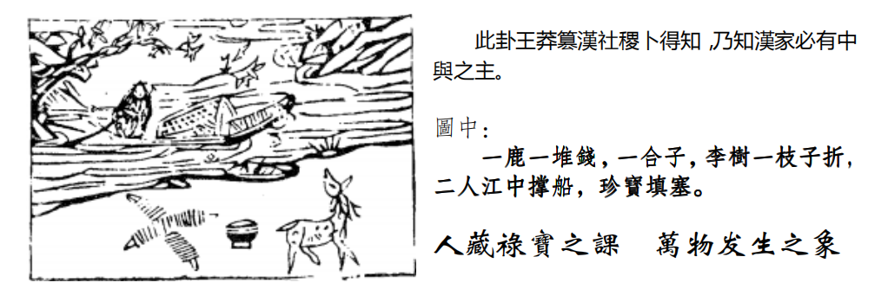
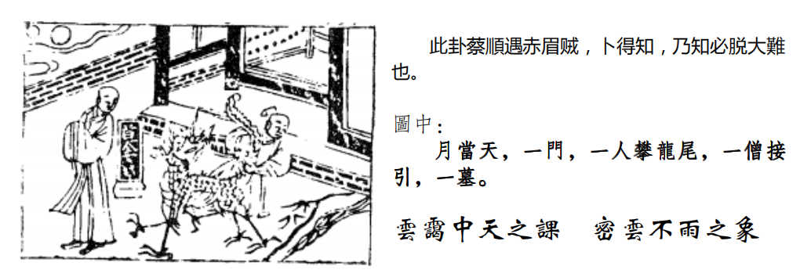
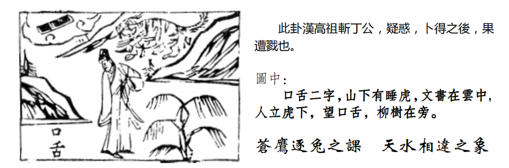

# 天纪 06 蒙 

蒙的象哦，山下有水，那山是外卦，水是内卦，水呢是险，内险，外是止的象，外止内险。
举例，有个人到一个十字路口，不知道怎么走，因为心里有险道，慌了，动作停止，当他动作一停止下来在考虑，这就代表他在蒙的状况，所以易经有山水蒙，从这个动作，就知道蒙，我们人常常蒙的，懂不懂我的意思。
所以蒙没有关系，要有童蒙，你在蒙没有关系，你要问，敢问嘛，请教，不问我怎么知道呢，你要请教人家，人家一定会告诉你。

可是有的人会渎蒙，就是他已经成为蒙了，成了笨蛋了，我是博士，我怎么可能会错，我是天下有名的人，我什么都知道，我走马路，我还要问人家啊，结果找不到，迷路的，就是他了。懂不懂，其实这个问题，哲学才叫着博士，其他都叫做专士，你叫他博士就完蛋了，我不懂，遇到十字路口，不知道怎么走，我可以问啊,像小孩子一样跑过去,哎请教一下怎么怎么样,他一定会回答你的嘛,好了，你自己去猜测，自己去以为，结果猜测以为出来的都不是事实。
这是蒙，那么易经会告诉我们为什么立这个蒙，人会经过这个阶段，他就讲了人间道，他说，去蒙之道，诸位呢，要帮小孩子启蒙，也要注意，必待他诚心一致来求已，再告之，方能去蒙，必以贞正。

去蒙之道，要有时机，所以易经呢，告诉我们时机如何掌握，有一个人，他是你先生，结果你从我们这个班上毕业学完了，他没有听过我的理论，我的理论到你身上，你告诉他，他就蒙掉了，你有没有发现现在很多人，你怎么讲他都不听,今天你明白了这个方法,你想要主动告诉他,没有用的,今天以后不要讲了，要等他诚心一致来求你，诸葛亮当年隐居在隆中，他就是看刘备来，刘备了不理他，他不是摆架子，看看你会不会听我的，你要来问我就是要听我的嘛，要不然你来问我干吗，现在很多人，去问了人家，然后回来还是自己的意见，那你何必当初去问你，你问了半天，浪费人家口舌，然后你自己又没有收到。一定要诚心一致，小孩子来问你的时候，他不懂啊，他诚心诚意，他是童蒙，诸位要保持这个童蒙,要保持赤子之心,诸位想想连尧舜都不耻下问,对不对,气量大一点嘛现在很多才智之人，外面很多博士，肚子能容万卷书，一句话都容不下，你知道不知道?这叫做气量大吗，为什么容不下呢，他平常心来问你的时候，代表他想要，这个时机你告诉他，才能去蒙，否则他不想听，你后面跟着他，哦，你一定要听我的，很多妈妈现在都是照样，你不要理他，要待时机，待他诚心一致来求己，再告之，方能去蒙，必以贞正，必以贞正这句话很重要。

我们的阳宅学,易经的阳宅呢,东南西北,这个九宫八卦立位的时候,夫妻，子女，一千年也不会改变。

这个卦就定在那里，外面的阳宅学，你找他来看，哎先生，对不对啊，你家这个东南西北,这里是客厅,你家客厅摆一个盆景比较好,这边挂一幅画比较好,讲完了哦，然后你明年再请他来，哎这里怎么可以摆画呢，你错了，这边摆错这边要摆个鱼缸。先生你去年讲的话跟今年讲的怎么不一样呢，他本来不蒙了被你造成蒙了，不贞正。前后不一样，你懂不懂。
外面的这些阳宅学,为什么会这样,因为他没有法则,他都是在形上做文章,所以每年都不一样，你看法国巴黎设计师，每年都要设计过衣服，我们这个阳宅一千两千三千年，都是这样子，64 卦，是他的神!所以外面的阳宅学是狗屁啊。你根据什么，根据他自己说的，懂不懂，他今天说的，跟明天说的，不一样，等他真正死的那天也搞不清楚阳宅学真正好在哪里。太差了。那你放心，我们这里讲的是真正的方法，十年后，该是天地否还是天地否，大概讲天地fou，但是是一样的意思啊。这就不重要了，这是形嘛。

这是去蒙之道。
所以过去我们古人,在民智未开,百姓还是蒙的时候呢,君王呢,发民之蒙必以刑禁。帮老百姓启蒙，做良好的国民，大家一起同舟共济，国家出力。发百姓的蒙，一定要以刑禁，所以呢，立法为先。这是国运来看。所以立法非常的重要，那你还要教啊，教人家，百姓才不会造成不教而诛，为什么，他犯了法他也不知道啊。因为你没有去教。第一个。
第二个，立法的精神要有，现在立法的方法有问题，真正要立法，我提一个方案,如果立一个计程车管理法,这个法要适用使用才行啊,第一找个立法委员;第二个找个交通警察;三找一个计程车司机;第四找个法官;第五个找个老百姓;找这几个人就够;立法委员没开过计程车，他不知道开计程车多辛苦啊，冒着痔疮的危险,冬天闷在里面,脚还风湿,还有担心某一天上一个人拿刀抢劫怎么办,你要找一个开计程车的人，执行现场交通警察，然后法官，法官的立场怎么看消费者百姓的立场怎么看。然后立法委员，这样的立法才合用。你找一票从来买有开车计程车的人在那里立这个法，什么嘛。大错误了。
易经告诉我们要发蒙,你在欺蒙,懂不懂,你利用蒙蔽百姓来助长你的权利不行!所以蒙之道反过来，当你蒙骗我，你立出来的法，不合理，不合百姓用的时候，我告诉你，你在欺骗百姓。那你是为自己利益着想哦。你可以是受到什么利益团体，然后立法是符合那个利益团体的利益，你根本没有为百姓办事，所以看一个真理，真面看也是看，蒙，如果一个人需要用蒙蔽的手段，代表什么，代表他想图什么东西，易经告诉我们这样子。所以需要诸君的脑子清楚啊。
这个蒙啊，蒙致极，蒙到了极限以后，发现没有办法了，你怎么样教他，你在那边等他，他都无法明白，蒙的很深了，积重难返了，到极限了，易经上说实在无法了，易经怎么写，利用寇，当击伐之。他已经没办法沟通了，修理他，六四天安门事件,请问大家,如果你是邓小平,你怎么办?国家就要完蛋了,击伐之!但击伐有一个限度，懂不懂我的意思，你不要表现用武力全干掉，那百姓都没有了，国家只有一个人在那里当国王，那是和尚啊，对不对，所以极蒙的时候,教育他要有一定的限度,打到他启蒙的限度,就停止下来,利用寇,征战没有办法了，击伐之，始中，不可以太过。

即使我们不懂这个，我跟你打官司，告你，然后告我了，我赢了，你千万不要说，我赢了，我好开心，表现给你看看，我告诉你，你会增加仇恨，赢了我也不要去太乐。要指出是他错了，很谦和地对待人家，这样才不会有后遗症。这样就上下顺。所以个人认为当年 tanm 事件 dxp 他们这样做的，是对的，没有办法。你随便找个那边的人，不管是谁，处在这个位置，你看他怎么做。你要反面想啊，对不对。这都不对的。你在逼得没办法，这样子。
诸位来看占卜。

有一只鹿站在地上，那你说老师我知道鹿者禄也。那你知道我为什么教你们读图啊。诸位是否知道以前有本《无字天书》，就是没有字，只有图啊，你当他白纸一张啊，好好笑!我们在读图啊。
那地下两串钱，两个串，就是(忧心)忡忡;
一颗李树，一只子折，
李树开花，不是肖李的，而是李姓的人;子折的话，儿子天折。
满船珍宝，二人在江中撑船，珍宝乘船，有两个人在海上撑船，船上都是珠宝，鹿在陆地上，财禄还是有，钱还是有，但是钱还是让你忧心忡忡，大部分珍宝还在船上面，这是卜筮，易经告诉我们。
结果呢，是一个盒子，一个盒子呢，是先成后破。
整个卦，蒙啊，整个蒙卦，整个读起来，就是李姓的人，儿子天折，如果出现蒙蔽的手段，为的是财禄，钱是在那边，但是真正的珠宝，还是在船上面，大家忧心忡忡，但是整个一句话，对不对，先成后破。

所以为官之道，一定要有清廉，为政者，不可以有任何的贪念，大家都说要做大官，做大事，话谁都会说。但是要知行合一啊，千万不能说，你们做大事好了，大官我来当就好了，不可以哦，要知行合一。这是山水蒙。
所以，除了蒙蔽，我们如何启蒙，反过来看，如果我用蒙蔽的手段对付你你发现我在蒙蔽你的时候，这就代表说我有所企图，懂我的意思把。没有什么企图，有什么好蒙蔽的。
蒙蔽了以后，启蒙，蒙之极，蒙就开了，对不对。

# 水天需

蒙开了，进入下一个卦，水天虚。为什么要水天需，水呢，外险，天呢，内健，天是刚健，如果一个人，内健，每天在家里充实自己，外险，外面很破烂嚣，需有等待的意思，等待时机的意思。

那为什么蒙卦之后是水天需,这就好比一溜一溜的顺序,好像小孩子的成长爸爸妈妈结婚的时候，叫做乾为天，坤为地，然后妈妈有一天怀孕了，胎儿在妈妈肚子里，叫做水雷屯，小孩子一生出来，山水蒙，那小孩子要成长，就是水天需，所以物之始生，必待养成，等待养成这个时间呢，就叫做水天需。

反过来，当你要养成你自己，一定要外险内健，你把房子弄的破破烂烂的，每天在那里好好的读书，我告诉你，你不要担心，小偷都不会来偷你。如果你把外面搞的好漂亮，你在里面读书，突然一天院子有响声，小偷来了，你的念已经走了，好不容易进入神，结果一晚上读了5个小时，实际上只读了一个小时还不到。所以古人住那个茅草屋里面读书，就是很静心读书，他躲到山洞里去读书，小偷都找不到他。
这是外险内健，等待的时机。所以需者，等待，饮食之道，养成，这个是水天，这个水往天上走，就是这个云嘛，对不对，是不是有蒸润的象，就好像人吃东西到肚子里去，食物在养育这个人一样，所以，我们天人合一，看天上，水汽蒸发上去,就好像我们人一样,你水喝下去,过一下嘴巴津液就出来了,有没有这是正常，如果你喝下去，喝完了，还是干，那你是有糖尿病了，这些在易经中医的理论上都可以用到。本来天人就是合一嘛，本来你就是上帝造出来的。

所以易经上，光看这个卦，诸位就知道了，有一个刚健的人，天是天下最刚健的人，结果他知道外险，越是刚健的人，他不会因为刚而急躁，求功心切，往前冲,他都知道要等待，哦,这个就是很厉害了,懂不懂,水天需的卦就在这里。外面的人个性急躁，求功心切的人很多，但是他知道，越是照样，他越要等待时间，哇，那就可怕了。那外面很多的庸才，一年十二个月，换了十三份工作，这种人就是庸才废物啊。他每天都在那里说时不与我你看我多有能力啊，可是老是找不到适合我的工作，世界上哪有那么适合你的工作，你又不是天子皇帝，我巴结你干吗，对不对，应该要想办法让自己去适应环境才对，所以现在民心不古，就是这样子。
人间道来说的话，刚健，刚是有自己的原则，健是非常有知识有学问的人，刚健之人，知险，知道外面是险的，待而再进，等待时机而进，这是至善之道。

这是最好的做法。
那至于六爻的爻变，诸位自己去看书，或者是看人间道，我会写在里面如果以占卜来读这个图，

他画了一个人，一个和尚在那里，有条龙在院子，有个人拉着龙尾巴中间放了个坟墓,然后上面有一个墙堵着,上面有月亮,有个门在后面,有没有，这是什么东西啊。
诸位看，一个和尚，僧引路，入空门，吉。过去很多，因为户籍不发达，他没地方跑路，就跑到和尚庙里去，所以你看少林寺，不管是什么忠烈之后，都跑到少林寺去。当和尚，入空门啊，我不知道先寺庙里面有没有通缉犯，我要是通缉犯我就藏进去，我的法号叫做悟因就不是倪海厦了。
那月当天，代表阴人居位，代表皇帝是女人。

坟墓在这边，代表是福，因为坟墓里面一定有棺材，就是官与财。墓中有官与财，意思是说，当你卜筮卜到水天需的时候，佛家说了，你呢要置之死地而后生，为什么呢，因为一是生的最后一条线，死呢，是一的之初，生之末,死之初，是一。所以一代表是什么，生的尽头，死的开始，所以生死在一线之间，这个死不一定是真死，或者是脱胎换骨，换了一个人出来了，所以你看各位看很多电影里的情报局，千完了事情,改头换面，或者美容一下,换一个人,生死一念之间。有个人找你测字，倪先生，我妈妈重病，你看看有没有活命的希望，我说你写个字来好了，他写个一，啊糟糕，生的尽头，死的开始，有没有，完了，象就出现了，所以诸位看一些事情，我们可以推想到任何一个地方去，所有的东西测字、卜卦、都是一个机，一个机锋，就是老天爷来提醒你了，随时找一些临机的东西，就像我那天讲的，当你要乘船出远行的时候，你拿包袱上去，一看老鼠从船上下来，小心哦，这个船一定会翻船，动物都比你懂，它要先跑。

所以在地下三寸的地方，天气和地气的交接，刚好在三寸的地方，所以我们人如何躺着,这里刚好是百会,脚底刚好是涌泉,天和地一样的,所以地下三寸,空气永远是新鲜的，火灾的时候，你可以去闻那个地气，你不要去闻天气，上面都是烟雾啊。
置之死地而后生，遇到这个事情，就是照样解。
那山水蒙，跟水天需，如果在阳宅上来看呢。

# 山水蒙 阳宅

山水蒙，一般来讲是东南西北，三子去住在二子的位置，蒙卦，但是这是表面上的解，解到神，精神上的解，就是妙用。
不管是任何人，不管你是乾，坤，还是爸爸妈妈哥哥姐姐，随便，有一天住到北方的房间，北方是坎卦，是水，是险，险道中求，知道我的意思吗，什么叫险道中求?你爸爸住进水的位置，天水讼，跟人家打官司;你妈妈住进坎，地水师，出门跟人家吵架，反正任何人住进去，他会行险之道，所以很多人，没有结婚的人，有官司是非纠纷，几乎都是在正北。结了婚的人去住，也是正北，所以一个房子，中心店的正北方，一般来说，不要给人住，它是二子位没错，可是它是险道，诸位，以前四合院的时候，记得吗?这东南西北。

你要是连这个东南西北也会弄错那就没有办法了哦，那正北方是正厅，他就放祖先牌位在那里，没有住人。你看四合院一看，是不是这样，那你说我喜欢住正北，一住就坐牢去了，正北方是行险，所以你发现你的孩子很奇怪，老是喜欢去做一些冒险的动作,不是从墙上跳下去,就是去赌博式的活动,喜欢这些东西他就是在行险，或者买毒品啊这些东西，这是住在正北方，诸位要记得!这是批到神。
所以不管你是谁，住到正北，下卦都是险。
山水蒙，但是我们阳宅上，刚好是三子住到二儿子的位置上的时候，婚姻就要加减。就是要提前，我这里先跟诸位介绍提前。那提前多久，以后我们举例的时候，我会综合讲。我会告诉诸位，如何提前，如何延后。

# 水天需 阳宅

那如果是水天需呢，在阳宅上面，这个水天需的意思呢，房子来说有东南西北，西北角是乾卦，正北方二子是坎卦，也就是代表二子住到爸爸的位置，这个叫做越位，越位的现象呢，第一个，智慧成长太快。住到爸爸的位置以后，你会发现你这个二子奇怪，怎么动作那么老成，出来不苟言笑，你跟他凶，他比你更凶，他要做爸爸，他就会认为他就是爸爸哦，他谁都要管哦，好处呢，他非常顾家，我就是爸爸，你们放心，你们不要出去做事，我出去赚钱好了，他就不想读书，他的想法我就是爸爸，我要替家承担，所以很多小孩子，爸爸妈妈根本不需要他去赚钱，他要去赚钱，你抓都抓不住他，就是因为住在乾位。
第二个，婚事延后。或者是不婚。或者是娶二婚妻。为什么要过，阳宅部分占三分之一，天占三分之一，地理占三分之一，人间道还有三分之一.

他婚事延后，他住到爸爸的位置，他就是爸爸，为什么会后，第一个，他20岁的人，住到 40岁的位置，所以你看他的外形是年轻的，但是他的思维到了40岁，这个时候，他交女朋友，这个女孩子我不喜欢，太幼稚了，我跟他在一起好像爸爸跟女儿一样，第二个，现在先不要谈感情，我事业还忙不完，你看我家里还有一票人要养。其实那些人不要他担心，但是他自己有过多的负担在身上，然后呢，还有人不结婚，他就是不想结婚啊，他觉得他已经结婚了，家里面兄弟姐妹都是他的子女一样。
或者是娶二婚妻，为什么，因为他是未婚男住到已婚男的位置，他就等于已经结婚了，然后他看到太年轻的，他就不喜欢，他喜欢离过婚的，或者年纪比他大的，在这个位置上会有这种现象。所以有些男孩子娶到太太年纪比他大，或者是离过婚的，大多数是在这个位置上。这就是阳宅上面，要把命里面做加减。同时间生的人很多，住的地方不一样，双胞胎一住进去，这个坐牢，没事在黑道乱搞，那这个呢，他去看牢房看他，说你放心，你好好呆着，我出去赚钱养家。我不结婚没有关系，因为我就是爸爸。
所以诸位，你就站在外面看，不要讲话，你就知道里面的内部情况，你看看他讲话，里面怎么样，你就都很了解了。
到了更高的阶段，算命的八字，都变成形了，算命算半天，最后还是要改运嘛，有问题，最后变成没有问题，才是重点。

# 天水讼

再来是天水讼:为什么是天水讼，水天需是饮食之道，因为有饮食，大家就会去争，有了争以后，大家就有了讼，所以讼之初，一定是有争，有争夺。各位看,讼是官司诉讼纠纷的,外面是健,内卦是险,是不是变成外健内险,有一个人，外表装饰的很好，里面是空的，这是讼，诉讼的源头。

比如说,我西装笔挺跑过来,然后开一部很好的车子来,先生你借我五十万,这是外健内险，同样一个人，如果外健内险，他每天都在做人，他做的很成功，世界上的好人坏人都叫他是好人，外健哦，但里面是空的，因为他花所有的时间去做人，从来没有时间去充实自己，内险，内心是空的，也就是外健内险，结果是被人家骗了满地，为什么，因为他要去做人，他就要对人家好啊，遇到坏人要求他，他就答应了，就是内险，他从来没有求内实，内心一定要实哦，讼之源，诉讼的源头。
一般来说，诸位我们在看人的时候，已经开始官司了，都没有去源，源到这个人本身的心态，最开始，就是外健内险。
还有人打肿脸充胖子啊，外健内险，你要借钱他说没关系我帮你借，结果他就吃官司了，都是这样子。

所以讼是虚卦的续卦，因为食物有争执才有诉讼。
所以我们人，在人间道来说，内心抱着侥幸的心理，外刚强不服人，这是致讼之源。

如果我们看到一个人，内险外健，所以成讼!如果一个人，健而不险，不生讼，这个人一辈子不会打官司，
反过来，如果这个人，险而不健呢，就不能讼，根本不能打官司了。了解他的意思吧。这都是属于人间道。
一个人呢，如果是险而又健，是以讼也。会打官司。死不认错。
如果一个人健而不险，从来不行险，不抱着侥幸心理，一天到晚充内实，从来不行险，有一百万，我投资 30万做股票，20万做债券;我一百万，投五百万做股票，外键内险，为什么，我想在经纪人面前表现我是大富啊，外键内险，讼之源。
健而不险，根本就不生讼。有的人，险而不健，冒险了又是空的，不能讼，根本不用打了，肯定输的。如果你拿出来的案子要跟人家打官司，你一拿出来你这个人做的事情本来就是险而不健，这个官司根本就不能打，一打一定会输。

诸位看，占曰，你看卜筮的时候:

图上面呢，有个口舌二字，就是官司纠纷了。
山下有睡虎，人入险地而不知。
虎呢，代表王姓人士。或者是属老虎的人。或者是明正之官人。
如果你看到,有人问你,倪先生,你看看这件事我们这么做会这么样子?好，我们卜卦，一卜得天水讼，先生，你这样做，一定是官司纠纷，因为你在行险老虎没看到,但同样的,老虎也是你的贵人,如果找一个肖虎的,也是代表贵人。文书在云中,主幻想,心想事不成,比如说,倪先生你看我今年会不会生官一卜,天水讼,对不起，本来你的官运要发,但是你现在官司缠身,所以不会升。你现在不要想生官，好好打官司好了。
人立虎下，人站在老虎下面，告诉诸位一个脱险之道，什么意思，易经告诉诸位，险事发生的时候，近险为脱险之道
比如说，我是公司的老板，工厂里面，哎呀，今天有人死掉了,机器夹死的，你不要跑路，关你屁事，又不是你杀他的，你怕什么呢，你一跑路就心里有鬼，法院找你的时候，你要马上出面，要近险，才是脱险之道，了解我的意思吧。这才是重点。脱险之道。不要跑路。
所以一切事情，要面对它，绝对不要逃避问题。逃避解决不了问题，要面对问题才能够解决。如果我是通缉犯，我找个和尚庙离警察局最近的，然后我每天吵他，然后他知道我在这里，他就会忘掉我是谁。他只会说拜托拜托你不要吵就好了。你跑到山里去，他派人在山口路口，结果我就住他旁边庙里天天吵，他就说哎呀不要吵了隔壁邻居投诉，就没事了。这是脱险之道。
这里画一颗柳树，柳的性，风再大，柳条在那怎么晃也不会断，告诉你，能屈能伸，大丈夫能屈能伸，该呆就呆该跑路就跑路。韩信能忍胯下之辱，大丈夫就是柳的性。
所以能屈能伸，就是君子之道，所以呢，能够避讼也。

所以诸位你只要记得，发生什么事情，管他对错，先认错，没有人会找你麻烦,找你打官司,打官司谁愿意啊,都是火大了要争一口气跟你干到底,懂不懂所以车子出事，你不要管谁的对错，先下来，对不起对不起!一定没有事情，反正都有保险公司赔嘛，当然台湾是想尽办法不赔你，这是天水讼。所以我们很欢迎国外的保险公司进来。

# 天水讼 阳宅

天水讼啊，阳宅的位置呢，夫局二子位，必讼!所以爸爸如果住在正北方，做什么事情，都有官司，他就会发现，我怎么这么倒霉，从我搬到这个房子，开车子从车库出去和人家打个官司，然后回到家里来也打官司，上班按电梯把脚夹到还要打官司，每天扯不完，讼!
所以你在做事业上面，有一种人没有关系，就是你本来就在讼，比如说律师法官，讼啊，要是没有讼就没饭吃了。那其他的做生意，最好不要讼，对不对。

住在这个位置上的时候,运上面,是命运的运，父降位，降到什么程度,好，诸位看这个，东南西北，父亲在这里，长子，妈妈在这里，爸爸是第一，妈妈是第二，长子第三，长女第四，第五是二子!
如果你的名字是爸爸，结果你不幸住到二子的位置，意思是说，降了五位，懂不懂我的意思，好，本来你的八字里面，32岁那一年是天同化权，哎这位先生，你 32岁，掌权做主管，但是因为您住在这个位置上，发生官司是非纠纷延误了5年，变成 37 岁才升。这是加减。要不然同时间生的人，同时生官同时发财啊。看位数在哪里?本来 32岁化禄，化权又化禄，哎呀，张先生，您 32岁的时候,您可以脱离开来自己做生意当老板,但是以为你住在北方位置,对不对，你要等到 37 岁以后才可以自行经商做老板，要五年。以此类推。会不会看。

还有，这个李先生，您住在正北方的位置，您老是在行险，您做的东西都是很冒险的，六合彩什么的，我表面卖槟榔，里面卖吗啡，天水讼，那你如果是住在西北角的话，内健就不是一样，外面卖槟榔，回到家里读书，所以不一样啊，内健在这两个位置就相差很多哦。这是行险，有贪念，懂不懂，有贪念产生，你才会去行险啊，你没有贪念行什么险。
所以我们人，上次介绍良卦，是止的象，就是目所不见，你没有看到，欲望就止住了嘛。女孩子一看到漂亮衣服，完了，人走了眼睛还这样斜着看。她就是不能止她的欲望。
所以阳宅上一讲，这样子加减会了吧。

# 地水师

地水师，很好玩，爸爸住过来是天水讼，妈妈住过来是地水师。
讼卦完了，就是地水师。诉讼打完了，一定会结仇，所以我刚才讲过，就算你打赢了，你不要沾沾自喜，到全世界去宣扬你打赢了，然后那个输了的他会恨你哦。打赢了也跟他说，很抱歉，我不是想跟你打官司，我只是想告诉你你的动作是错的。你要反过来想，你要认错，将来你服刑什么什么的，一样会很好的你给人这样做，这样态度就没有了。如果你到处宣扬，你看我打赢了。
所以讼之后，有师之道。所以两个国家开始吵，吵不完了，武力解决，就是
师。
为什么叫做地水师呢，我们古圣贤哲一看，嗯，地下有水，有没有，诸位你看地下水，都是聚在一起，聚的象，所有的部队聚集一起，是的象。
水到地上来了，就是水地比嘛。水还是在下，叫做地水师。师有军队、出师、兵道，光是一个地水师，我们孙子就写了一个兵法，兵书，你看易经六个爻，从此你就是很好的名将。晓得如何出师，如何打仗。
我们如果以外卦内卦来看的话，变成地是顺，水是险，为外顺内险之道。比如说，我是受命出兵的将，部队都出去的时候，大家都集结，听命于我其实我最紧张，打败了我怎么办，心里很紧张，兵是行险之道。意思就是提醒不得宜势必要出师的时候，要战战兢兢，随时抱着打仗打败的打算，心态要这样。

再跟诸位讲，念很重要，你的心里的念呢，就是险，随时要提醒自己，这种人才行哦。
外险内健，你的心内很健，你放心，没有任何人会告你的。但是你如果是出兵，师的话，就要随时警惕自己。师之意。所以，我们出师，就是专门在行险求顺。这就是兵书上面的意思。打仗是逼不得已的，我们一定要求他的顺利，但是每一个动作都在行险。
记得唐太宗问李靖的时候，古今胜败，一误而已，所以出兵打仗，不能有一点失误，因为你没有从头来的机会，绝对不容许自己第二次犯错的机会，如果你抱着前锋打败了没有关系，不能这样想，一点一滴一兵一卒统统要用到。要顾虑到这种状况。

到了人间道，师，以正为本，后世说要正名才能出师，正名为本。名正，以毒天下，民弗怨也。贞正吉。
比如说一个国家有外患,就像当年常凯申号召十万青年十万军抗日的时候战争一定会对百姓造成伤害，百姓都不埋怨你的时候，这就是可以打的时机。国家有动乱有外患，都是正名后才能出师，这个师之道，是吉的。那出师呢，要丈人，不是说找你的岳丈，而是说要找一个帅去领导这个人这个人可能在国内的时候，是听命于你，但是一旦派出去为帅的时候，第一个条件，必须这个人要受人家所有人尊重，第二个要君命有所不受。当出师的时候，命令要贯彻，带兵打仗，都是专制，一定要专制，自古到现在，打仗的时候，再民主的国家,都要专制哦,易经来讲,出师之道,如果是众人来决定,那就完了因为胜败在一念之间的那个时机，时机来了，我们前方在作战，来，我们大家开个会决定怎么办，那你肯定打输了，等你决定完了，前线的情况已经变了，你懂我的意思吧。就好像三十八年 大陆沦陷，稍微等一下，我考虑看看，我是留下还是跑路。两边都不好啊，等一下在沦陷好了，哪有这种事啊，我们大家来开个会研究看看，多数走的举手，留下的举手，都沦陷了，大家都别去了。所以出师的时候，没有民主，一定是专制，所以师之不得已才行。这是师之道。
当你打仗回来，师之终，功成名就回来，这个时候，大君有命，开国成家小人不用。天下打下来了，回来，绝对有功劳的封赏统统分好，但是他提醒你绝对不能小人有功劳，而用他，如果你发现军旅中他是小人，在打仗，在一个公司开创业务的时候，打天下这段时间，你知道他是个小人，打完天下，他有功，给他赏赐，但是不用他。小人不用
所以易经所有的道理都是告诉我们防范于未然。免得以后你后代子孙遗患。
