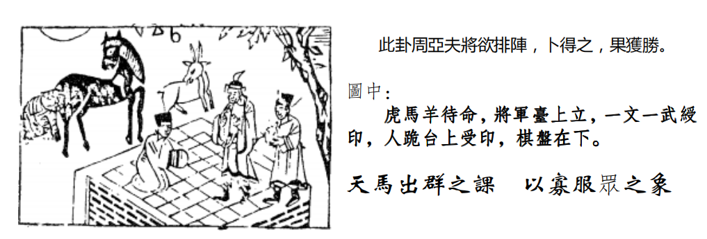
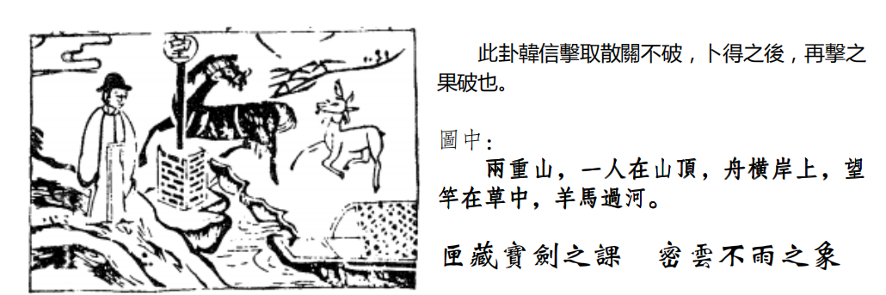

# 天纪07 象数易经

## 地水师 占卜

地水师的卦象前面介绍完了，我们介绍占。

诸位看里面，如果你要断事情，占卜，一ト，地水师，带来的信息是什么，第一个，里面有一匹羊，一个马，一个老虎，有没有看到，这三种人，卜到这里，就成格，懂我的意思吧。
大家注意看，里面有一个羊回头，回阳，如果这个人在重病，你卜他，一ト到地水师，哎这位先生，那个病人属什么，啊他属羊，恭喜你，他会从阴间回到阳间，听懂了。马回头就没有用啊，回马啊，要回羊嘛，羊者阳也。
那如果属马的时候，后面的老虎顶在马后面，看到没有，老虎是马的贵人，那你卜一个时期，有羊有马有虎，这个战争可以打了，地水师，出兵了。
那有文武两官在受印看到没有，得众人服之帅，诸位记得我们地水师要“丈人吉”,有没有,就是要找一个大家都尊重的人做元帅,因为军令系统要专制的，因为打仗就在那一分钟之间，你给众人制的话，就完了，战争就打失败。

丈人是能够得到百姓爱戴大家都相信的人，来指挥统御，大家都没话讲，得到万人的尊敬。
一个人站在棋盘上面，诸位看这个棋盘，他虽然格子划得不多，但是密密麻麻，划得像棋盘一样。诸位哦，如果你看图，看一天也不懂，你去找你儿子，儿子啊，求求你拜托你，你看这是什么意思，你儿子在旁边看你们下棋的时候，他就会问你，爸爸，为什么下这个棋的时候，越下子越多，下那个棋的时候，就越下越少，所以象棋的时候是越下越少，围棋是越下越多，你儿子看到了，你看到的是围棋象棋，你看到形，他看到神，所以围棋代表越下越多的意思，围棋盘，那围棋呢，也是一样，这个事情可成，但是要谋略，要计谋可成，所以围棋代表越下越多，象棋代表越下越少，如果你是做商品，我卖这个娃娃好不好，一ト，得地水师，然后你属马，一看股东属羊，一看旁边那位属老虎是你的属下，那太好了，开，为什么，越卖越多，是不是。
有一个人呢，将军台上立，代表手有兵权，也代表有生杀之权，都是代表这个意思。
这是读图这部分。

## 地水师 阳宅

阳宅的部分，什么时候有师卦出现，你是妈妈，母居正北房，师!这个有没有问题。一个房子，东南西北，结果妈妈正好，住在中心点的正北边的房子，你妈妈就是地水师，你出去看马路上那种泼妇骂街的都是地水师，出门很凶悍，本来大家出门都很愉快，她看人就像看仇人看，这就是地水师，她每天出来就是出兵打仗，看到人就仇恨，看到人就吵架，甚至还打人，计程车上都要撞个洞。我讲的都有历史的哦。只是现在变成小说。
那这个地水师，诸位记得，易经里面，在阳宅上面，八卦里面，只有坎卦代表险，是险中求，任何人，不管你家排行老几，过去中国人呢，阳宅四合院。

中间是晒谷子，中间正厅的位置，是不住人的，因为正北方坎卦是水，所以任何人住进去都会有险中求。所以妈妈住进去，她会地水师，她为什么这样子，心虚，自己做了什么不能够露脸的事情，反而会心虚，看到人好像仇人一样，记得高中课本讲过，一个樵夫的斧头掉了，砍柴为生的，结果他掉头后出门看他村庄里面的人每个人都像偷他斧头的人,结果三天以后在深山里面找到他的斧头。这时候他看大家又不像偷他斧头的人。这个人就是着相，你如果让一个小孩子住在水卦,不管是什么卦,住到北方的话,大部分都会行险,去做冒险犯法的事情那有的人,偷成瘾啊,家里有钱啊,但是他偷起来很爽很过瘾,你看电影很愉快，他偷东西上瘾，他想法不一样，他就会去行险，所以住到北方的常常会有这种事情，我看阳宅的时候，罗经打开来，一看正北方，哎，怎么有一张床在哪里，谁睡的，我儿子，你儿子刚出来啊，一天到晚吃官司，哎你怎么知道，他儿子在旁边吓到了，马上立正，我说你刚出来吧，不好的话还要进去，他吓死了，然后赶快换地方，那你怎么知道他刚出来，那个人从里面出来，脸上好像都没洗干净样，好像早上没洗脸，如果你有空哦，你去法院旁听席上一看，那个法官会传讯那个疑犯，那个人一出来，你看他的脸，整个脸就是会会的，黑黑的，好像灰尘在上面，好像没洗过脸一样，暗暗的，那刚出来，还有两个礼拜的气色，还在担惊受怕，晚上睡在家里，心还在牢房里啊，那晚上睡觉就怕早上有什么事情，所以他气色还在，你一看就能看到。这是地水师。

那太太如果住在这里，先生一般跟太太住同一个房间，那就这家人变成，妈妈变成地水师，爸爸变成天水讼，你看到，即使他们跟外面没事，他们两个也是一个师，一个讼，懂不懂，妈妈去打爸爸，然后爸爸去告妈妈，刚好了。夫妻冲突就来了。结果传讯的时候,先生说我被太太打了,法官也不相信,看也不相信地水师。
这是用在人间，阳宅上面用的。

## 水地比

师卦呢，出兵征战了以后，天下治世啊，始治之时啊，刚开始治的时候，天下大乱之后，刚好天下太平了，对不对，刚开始就是人相亲，所以下一个卦，就是水地比，比呢，就是有亲和的意思，那我们为什么叫水地比，我们的老祖宗圣贤呢，一看到自然界啊，最亲和的，就是水跟地，就是那么简单，水永远顺着地走，世间天地间，至亲的就是水与地，所以地上有水，为比。自然界的象是这样，老祖宗每天看地上的水在那里流啊，亲和之道在那里。所以易经上面讲比卦的时候，特别提到，两志相求，为比，两志相违，为睽。志气相同的人会在一起，志气不同的人，两个人不会互相往来，互相仇恨。

进入人间道以后，我们历史上很有名的，他说:同欲相憎，同忧相亲。这是一个不变的规律。欲望相同的人,小姐,你我两人都是副总,一起想升总经理哦这是同欲，一定两个人在敌视，我们两个人一起跑路，在海边碰到了，同忧，相亲。这是不变的，这是人间道，这是至理，你不需要去 confer，有没有道理啊这就是进入人间道，那最早出来的，在战国策里面，中山策。有一天，他们要立武王，战国时代，大家都想称王，齐国赵国燕国还有中山，立五王，齐国说中山这么一个小国家，我干吗跟它并列，就跟赵国魏国叫来，你们两国过来，当时齐国最大，中山最小，就把这两个国家弄过来说我们三国出兵把中山干掉，中山王听到这个消息啊,很紧张,怎么办呢,请了张登来,历史上姓张的都出鬼点子啊,他叫张登，中山王说称王不重要，国家要保存下来啊，张先生一定要救我，张登说好啊，你给我准备一些金银车马，我到齐国去，去了就去找田婴，是个庸才笨蛋，他说你们齐国是笨蛋，如果你要找两个大国，三个国家去打一个小国，那中山王就会去找赵国燕国说我把国家给你，来对付齐国，那你齐国不久倒了，你不是把羊赶到赵燕，什么都得不到。现在有个方法很简单，你不但能让中山王称你为君而且他的东西都属于你，田婴说有那么好的事啊，当然有，我告诉你，你现在把中山君弄过来，许诺他为王，他一定很高兴，齐王许诺我为王，最大的靠山有了啊。那我就会和其他国家断交，专门和齐国做朋友，那一绝交的时候，那两个国家就很火大了，齐王为什么要立他，当初说我们联合三个国家打他是你，把他立起来又是你，对不对，好，一定会去攻中山嘛，这个田婴上当了，因为你一打中山，中山就说我王不要做了，统统给你齐国好了，你只要做一个动作就好了，让他们挑拨之间的感情，好，田婴就接受了，张登就走了。那田婴旁边也有一个姓张的人,叫张田,他说报告国王,这个张登是有名的怀不子,你被他骗了，历史上不变的教训，同欲相憎，同忧相亲，所有的四个王，就担心你齐王最大，你如果一立中山王，其他的王都会怕你，当初你要打他，现在你立他为王，你立一个王，亲近一个小国，结果和其他国家作对，得不偿失。每一个国家都担忧你不让他称王。怕你并吞天下。每一个人都同忧。张田就说张登的话不能听。田婴说不听你，招中山君来称王。这个张登多坏啊，马上跑到魏国赵国燕国去，我告诉你们，齐王要来打你们了，为什么，他以前联系你们干中山君，现在他招他称王，要用他的部队，你们要小心，他们这几个国家一听，马上就联合起来，要对付齐国啊，赶快也立中山君为王，你看。厉害不厉害，所以自古不变的道理，要抓住这八个字的精髓,这是最好的外交官,也是最好的谈判。看人性看的最清楚,所以说，当你遇到这种情形的时候，你有这种认识。
同样的，当你是老板，两个人之间你要升一个人的时候，同样有这种情况，了解我的意思。那如果你要大家同舟共济,很简单,让大家同忧嘛。大家就相亲这是千古之道，人间道。

这个卦象，外面是水，是险，里面是地，内顺，所以比卦，相亲，亲和为比，所以呢，比之道。互相亲和就是外险内顺。你要跟一个人变成好朋友，要外险内顺，亲和嘛，外面要战战兢兢地，对他很尊重，里面要诚心诚意，要内顺，有的人是外表很顺，心里想着骂你呢，那你说如何看出来骂，我们就看的出来啊怎么看,他对你很尊重你,跟你讲实话的时候,他的手是上下,骗你的时候手是横的，这是人性。因为心摇摆不定，所以他的手自然就要摆不定。如果心很正，内顺的时候，手势是上下动的，这是外相可以看到，小人无法遁形。谁愿意当小人啊。当他手上下的时候，就顺了。
还有呢，就是讲话，讲话一直在偏离主题，不讲到正题，他就是要背叛你。他就在骗你。所以讲了半天，语无伦次，有没有，讲了半天，你听不懂他的话这个人就是在骗你。所以你马上可以发现到,真正的比之道,如果你抓到比之道天下没有你的敌人，也是一种天下无敌。天下无敌也有一种，你没有敌人，你外险内顺，外面很战战兢兢，里面很清顺，没有敌人。
注意看这卦象，图解。

## 水地比占卜

他怎么写的，月圆当空，然后秀才望月饮酒，自酌自饮，药炉在高处，枯树开花，是什么啊，看不懂，问你孩子，还没长大哦，还在幼稚园，进了小学就不要问了，就已经不懂了。小学看到了，药炉就是药炉嘛。
月圆当空，代表政治清明的象。
这个秀才啊望月饮酒，有二解，一个呢，代表才智的人，无忧。比如说来卜卦的人，倪海厦，你帮我卜卦看看，我是教务长我准备退休了但我又放不下这个学校，一卜得到这个卦，才智之人，无忧，你不要忧虑，退休好了，不会有什么你担心的事情发生。第二个呢,作秀的人,无法出头。比如有个立法委员过来问你看我继续看立法委员好不好，一卜，别干了，政治太清明了，你出不了头。如果是自酌自斟，一个人在明月当空，独自那那边喝酒的时候，无欲则刚这是去比之道，万一说亲和，相比的时候有问题，你一定要无欲则刚，才不会出问题，你跟人家来往，你有目的，你就会无问题
药炉在高处，代表无病无灾，药炉没有什么用了。

枯树开花，晚发。也可以说从头到尾代表有志者事竟成。你只要一心一意地往前走，有志者事竟成。枯树都会开花，代表晚发型。如果来问你的，是一个刚好二十几岁的作家，倪先生你看我专门从事著作好不好，一卜，不要，你晚一点再做好了。多吸收点社会经验，多看点人，不然你写的小说都是看人家小说抄来的，没有社会经验。外国人有的人，他为了写一本小说，写荒岛的事情，他就一个人住到荒岛上去独居，一住好几年，仔细体会才能写出一本书出来，你一个晚上就写出三本书出来，搞什么。那都不对的，要晚发。
相上面也有，你看耳朵，耳珠朝嘴，我们相上看耳朵，耳朵啊，眼睛啊，都不在大小，我看过眼睛大的笨蛋一大堆，耳朵也不在大小，耳朵要轮分明，有人说我的耳朵很大很好，那驴子的耳朵最大，那耳朵要轮分明，而且耳要比脸还白，那如果像我这样，耳珠翘起来，对着嘴，叫耳珠朝嘴，不是明珠出海哦朝到嘴巴，晚发。所以我只好算算命好，命格如此，只好晚发。

## 水地比 阳宅

阳宅:住到水地比，是次子居于母位。西南角就是母位，结果二儿子住在这里，比卦就出现了。
第一个，他会从母事，喜欢做妈妈的事情，还任劳任怨。你看我就是，以前我不懂,小的时候不懂啊,从小就住西南角的位置,从小的衣服都是我在那里洗，没有洗衣机,用肥皂洗,洗得还很愉快。我好喜欢洗啊,我怎么洗衣服这么愉快。我就在比卦上面知不知道，我就想做妈妈，妈妈去菜场我也要跟着，菜篮都比我大，很愉快啊，就是任劳任怨，很愉快啊不晓得为什么，所以这个念很重要，所以我常常对人说，如果你发现你儿子不听话，那就是他住西南角，好，第一个，然后婚姻呢，会延后。婚姻会 delay，娶女呢必长或二婚妻。因为他住哎妈妈的位置上,他就喜欢妈妈,他看到年轻的女孩子,他就不喜欢,他喜欢妈妈型。看到年纪比较大的会比较愉快。那么刚好碰到一个没有结婚的女孩子，那个女孩子是住在妈妈的位置，她看到男友，就好像妈妈看到儿子一样，对她男友很好很愉快，这两一大一小，碰到了，好了。你问他贵庚几岁，他小他太太三岁，但是他很愉快。就会有这种情况，这就是为什么同时间生的人不一样的原因。

那有一种特殊的现象，如果命属偏房，如果一个男孩子过来一看，哎怎么会拿到这种偏房命，就是说太阳星不亮，巨日格，或者是女命阳刚星太重，武曲破军星入命啊，夫妻宫是凶星，到头来是偏房，如果男孩子命属偏房，男人会有终生不娶的现象。会有这种现象。这是比卦。
易经是一个一个卦接连，顺序地发动，比的序卦呢，叫小畜。风天小畜，为什么比之后为小畜，比是亲比，大家亲和在一起，亲和在一起就会结社结合成一个社会，大家比较亲和，我们组成一个社团，易经学会，小畜呢，就是积的象，聚的象，小畜卦就告诉我们相聚之道。

那聚的好处有哪些，自然的象，外面呢，外卦上卦是风,风为顺，内卦是乾，健,对不对,刚健的健，内部有一定的原则,外面是柔顺的,这个象出现的时候,就是小畜卦，那小畜之道也在这个里面。

## 风天小畜 

要大家聚成一个团体，第一个，内健，本身有一定的实力，有一定的看法所以志同道合的人一定会同聚在一起，就好像蛇鼠一窝一样，所以你抓小偷，不是一个，而是一票。同志之人必同聚。这就是聚的相。
所以聚在一起的时候,如果外顺,大家都很和睦,内健,各人有各人的事情处在一起非常的愉快，这是小畜卦。
卦象哦，小畜卦出现，本身卦象上，以小畜大。
这里有个爻格，比较特殊一点，
风天小畜卦:

你看他的爻，就是物象，这第四爻的位置是阴位，是近君的人，六四没错这个位置是最近君主之位，这是相啊，将啊，下位。所有的都是众阳，一个阴在那里，上面的皇帝君王总统，跟下面的将相都是阳刚，起冲突，你一个人夹在中间，懂不懂我的意思，就是小畜，所以小畜之道，能够以小畜大，为什么，小畜是阴柔，柔，这个时候，你如果夹在中间，刚好你是他的秘书，办公室主任，你夹在中间，你要有小畜的道理哦。不可以落井下石哦，小畜嘛，对上是柔，对下也是柔，懂不懂我的意思，变成第四爻就变成了上跟下沟通的媒介。所以他以小畜大，懂不懂，畜的道就在此。

所以说能够相聚在一起后，产生的小畜的道理。现在讲的就是扮演这个角色
的人。
所以说，在天地之间，至刚之人或事，唯巽顺能止。性顺的人能制止他。诸位看，天已经很大了，风还在天上走。天之上只能容风了，所以说再刚烈的人，柔顺都可以去止他。这是小畜卦的定义。这是从外相来看他。

当你由小畜卦相亲比的时候，你能够用巽卦的柔顺，很谦和，柔顺，当然能够以小畜大，本来所有的山头，谁都不服谁，跑出来一个小畜卦的人，他就变成一个中间人,大家都听他的,大家也相信他,哪天挂六国相印的人,就是他了。诸位如果遇到这种情形，你说老师啊，我刚好现在就是小畜啊，上面的老板恨总经理，我偏偏是总经理董事长的助理，我夹在中间怎么办，易经就讲了，处小畜之道，君子小则文章才艺，大则经世济人之学。
遇到这个时机的时候，外柔内健，是不是小畜卦，你看畜卦的神哦，外面很柔顺,回到家每天都读书,好好的加强自己,因为你才德不足,只好阴柔在中间小则文章才艺,如果是女孩子的话,就多学唱歌跳舞,打比方哦,不要真的去啊或者回家烤面包做牛排做得很好,大则经世济人,学到好的学问,这是处畜之时你能够做到这样，就能抑众刚，所有的刚都要听你的。包括上面的都要听你的。

他写:有个人站在山上，有个望杆，有个马，羊在后面，中间一条河隔到，船在旁边，人站在两重山上，一个人在山顶上，这怎么解释，
两重山，第一个代表险阻大也。还哟，这个出是不是两重山，所以，出也。出来。比如时候过来一个人，时候倪海厦你看我今天出去赌钱怎么样，ト一下出，不要去了。这很多事情哦。
一人在山顶，第一个独行无依的象;第二个，向下坡的象，小姐你的事业已经到了顶了，以后只有往下走的了啊。
舟横岸上，准备出发，但是呢，无水不行
望杆在草里面，望杆就是等待消息啊，因为没有消息嘛，无讯息，故等待。为什么在草里呢，诸位读推背图马前课，所有的草呢，草头黄，你姓什么，我姓口天吴,草头黄,有没有,这个黄是我们中国的大姓,所以中国是李氏皇朝。一票都是李，为什么，姓李的比较亲和，为什么，水地比，李氏出现的时候大多出现皇朝之乱，所以民进党有黄**。这个要删掉!

上有羊马，就是马引羊渡河，你看是不是马走在前面，羊走在后面，所以马为贵人，第一是肖马的人，第二是姓马的人也可以，马是你的贵人，诸位看我们读图的时候，比较分开来，你卜卦一卜下去，那些事情就统统出来了哦，连贯起来了，知道吗，所以一个图的象，可以代表一件小事情，也可以代表整个国家的国运，所以从卦一路看下来，从山水蒙一路看下来就知道怎么样做了。我每次讲很多事情，就会有很过怪声音出现，今天没有。
还有呢，有时机，时机来了的时候，马就是贵嘛，所以马年，午年，或者是午月，或者是午日，或者是午时，这就是时机。
那你说有个人生病，重病，一卜，卜到风天小畜卦，你还没看的时候，好像天上风在走，好像灵魂跑到天上去了，就不太好了。

第一个，望杆头，我是草鞋，这个望是这样，夕亡，旦夕而亡，那你早上时一卜，午时会走人哦。然后他病重，再一看黄历，哎呀，明天刚好是日啊黄历上面，日有天干地支，至于这些千支弄不清楚没有关系，斗数交完了，64 个卦讲完了，我会教诸位用易经八卦来排列，卦的排列，啊，你今年流年是风天小畜，你今年流年是地水师，你今年流年是天水讼，了解我的意思吧，用卦来排流年。要用到四柱命卦，年的干支，月的干支，日时的干支，教各位这么排，这个不用担心。黄历打开来看上面就有日子的千支嘛。逢到午日就是凶。以此类推。然后你在卜卦呢，有个客人来问，卜卦得到这个卦，很危险啊对不对，那羊也跑掉了，羊没有回头啊，对不对，再一看，他日角黑的，他一定问爸爸，眼袋是黑的，这边是儿子，这边是女儿，眼这边是黑的，丈夫或者是太太。卦上面有没有丈夫、太太啊，没有啊，懂不懂，所以我们需要很多的资料来赋给我们，如果看着什么都没有，哎脸色都很好啊，那你是他什么人，哦我是她先生，这个定是坏先生对不对，他太太重病了他一点气色都看不到，代表他没有忧气，他就是想他太太快点死啊，他来问你卜卦什么时候死赶快争一些东西啊，会哦。

所以，诸位，我们学的，就是看到外面就知道里面藏了什么，我常常讲，我们下棋，如果有四个人下棋,AB 两个人下棋，走几步就走完了，走几步就，哎算了，重新开局，我输了，CD两个人走棋，走到剩下个帅还在那里走。你看看哪个是高手。懂不懂,我们学的己的就在走两步就知道了嘛,不要等到后面 confer这个不是我们的主见哦，如果我们没有这些本领，我们光是主观地，就会过于主观。我们为什么要学老祖宗那么多五千年的经验，就是不要让伤害很大的事情在你认为不可能的情况下发生!帮助你们在人生某个极端刹那间做决策，不会错的，因为一念之差，可能全盘皆输。所以我一开始就结束了。会不会推理啊，联想，这些我们都讲过啦，只是你没有把它连在一起。阳宅:这个阳宅不讲差太多了，我老是漏掉。

## 风天小畜 阳宅

阳宅会有小畜卦出现，长女居西北，这个都没有问题了吧，所以一定要懂我们那个图，这样以后就不要背，阳宅上面，长女应该住这里，结果不知道怎么搞的跑到爸爸的位置去住了，就产生这个风天小畜卦。
小畜卦出现的时候，我就是爸爸，我的身份证户口本上或许我是长女，可是我告诉你，我是爸爸，形上是长女，神上是父亲，所以像父，不是说脸长得像爸爸，而是主观很强，个性很强，家里谁讲的话，她都不听，我就是爸爸，爸爸还要听她的,第二个,我就是爸爸哦,你们都不要担心,我会出去赚钱来养活你们，她会给过多的责任给到自己身上。好，有利有。
那同此类推，婚姻不成，她太年轻，二十岁的人住到四十岁人的位置，所以思想会超越年龄很多，这个时候，她住那里，有25岁的男孩子来追她，她今年20岁，你的外形看是男孩子比女孩子大，但是我们要看神啊，这个女孩子看这个 25 岁的男孩:幼稚，像小孩子一样，我跟他在一起好像爸爸照顾儿子一样，好累哦。你看这个小孩子优柔寡断，我怎么能跟他谈恋爱呢，回头一看，哟，我们的教授好棒啊。教授是爸爸，懂我的意思吗，她就欣赏年龄比她打很多的爸爸型的男人。你看这个教授多棒，如果我找男孩子像他这样子就可以了。可是对不起，像他这样子的都已经结婚了，已经经验很多了，已经被太太和孩子整过的，浴血重生的一个人了，你要看他的真相!

如果你继续住下去，如果你不信邪，继续住下去，到老出家，不是出嫁哦是出家。但是因为是小畜卦，所以事业上会有积蓄，住在这个地方的女孩子，很有钱哦，但是她很小气，她钱都藏起来，这是她的优点。
那往往居于小畜卦的人，往往居于众刚之间，懂不懂，你看那个人，上面总经理跟董事长不和，或者是总经理跟下面的经理不和，那你刚好是总经理，那你刚好是小畜卦，然后你一看，咦住在西北角。得到上下的信用。手下没办法跟老板沟通,就去找她了,老板没办法跟手下沟通,也去找她了。她就变成中间人了。变成这样子，就是小畜卦。
这是从易经的象出来的，为什么说婚姻不成，到老出家，你想想看，未女你没有结婚在家才叫长女，如果你结婚了，就不叫长女，叫妻子了，你一结婚，名分就跟着变了，未女去住已婚男人的位置，好，
未婚等于已婚，你就已经不需要结婚了。女人等于男人，只有一种人男女不分，光头，秃头，那和尚尼姑乍眼看会看错人的。懂不懂，和尚尼姑分不出来，所以到老会出家。

我悟出来啦，然后到那里去看，嗯，这个是谁住的，我三女儿，哦那老大老二住哪里，老大老二出嫁了，哦，你不是三女儿，住在西北角，就是风天小畜，这种情况，就是大女儿已经结婚了已经叫妻子，家里老三就变成长女，这时候就补位,结果三女儿住到大女儿的位置,也是风天小畜卦,我说赶快从里面搬出来。

他说不搬怎么办，我说不办就念经念佛去了。他说念佛经还好，她都念日文的佛经了，每天在那里念，变成这样子了，这就是小畜卦。我说你女儿赶快移出来他说移到哪里,他女儿还没有回来,爸爸妈妈就已经搬好了。我讲他女儿这样子他说真的是这样，那怎么办呢。这是无意识间造成很多不可弥补的伤害，当然我不是说那是坏事，但是站在父母的立场，他只是希望女孩子好好的结婚啊，因为她 23岁了。不但一个男朋友都没有,每天抱着佛经在那里,我不是说信佛不好。而是一个事情要看周为人，不是你一个说了就算，很多事情。
还有一个，我提一个东西出来，名位相等，我深入介绍给诸位。当你的名，你是什么名字，住什么位置的时候，这个过程，我们叫做家和。当你是什么位置,住什么名的人,叫万事兴。现在可以深入跟你们来讨论了，这里关系到世代交替
真理的话，是个圆形的，随便你怎么换，都一样。
你说老师你讲了半天，好像只有两代同堂。

我们九宫图上，各个人的位置:
如果名位相等,儿子住儿子的位置,女儿住女儿的位置,夫妻住夫妻的位置，家和。
如果你要事业兴，要位等于名，住谁的位置要用谁的名。
举例，你的名字叫爸爸，位置住到长子的位置，叫做天雷无妄卦，你用你的名字开公司，那就无妄卦了，无妄之灾。
你的名字叫做爸爸，结果你住在二儿子的位置，叫做天水讼，你再用你的名字做公司的负责人，就叫做天水讼，准备打官司坐牢。
如果你住长子的位置，结果你公司用的是长子的名字来做，住他的位置，用他的名字来做老板，运就起来了。

所以说，如果你是先生，如果你去住到太太的位置，西北角是在没办法改，没关系，工商负责人改成太太，你从董事长降成总经理。
同样的,夫妻结婚了以后,年龄大了,夫妻本来是住西北,你夫妻不想干了，事业传给儿子，世代交替哦，儿子如果还没有结婚，你让儿子住东宫，儿子名位相等，当他位置住对了，才用他的名字来挂负责人，了解我的意思吧，如果要交给儿子的时候,儿子已经结婚了,父母亲退位出来,住到三儿子的位置,天山卦那儿子跟媳妇来继位，继在西北边，因为名字叫夫妻嘛。夫妻住在西北角，代表他家和，夫妻感情很好，反过来，他的名字叫做丈夫，位置住对了，才可以用他的名字来做事业负责人。了解我的意思吧。

这是阳宅上的活用。

# 南半球阳宅

这是北半球，是这样用;南半球呢，你就东西不要动，南北换一下，所以我们北半球是春天，南半球就是秋天，我们北半球是冬天，南半球是夏天。
所以我们在北半球的时候，男从北，西南从到西北来;南半球的互啊，主卧房要放在西南角。就是南北反，中间这两个不动。
你们先学会北半球啦。南半球就会了啊。老师你还有西半球东半球啊，我把你干掉。
这是位要等于名。
更深入一层，临床经验告诉我们，一进去这个宅，看到哪个宫在里面，那个宫很大，就代表这个家族发那个房，懂不懂我的意思。那一房的脑子最清楚，就发那一房。一进去一看,他们家南宫最大,他们家二女儿最强。一看西南宫最大，你想嫁进来，你就要对他妈妈好，她最强，不用理你公公懂不懂，了解我的意思吧。看到房间就知道。一看东宫最大，好吧，先巴结巴结你大儿子。先要把哥哥说服了，不然的话，他爸妈没意见，他哥哥冲出来否掉了。你敢泡我妹妹就把你干掉。看哪个宫最大，发哪一房。因为我要跟诸位讲这个想法。以后我们讲阴宅讲风水的时候，也可以知道。风水是看山川河流。

阳宅上面，就是这样。以后我们会举例来详细跟诸位谈谈这个部分。好，慢
慢让诸位深入。
